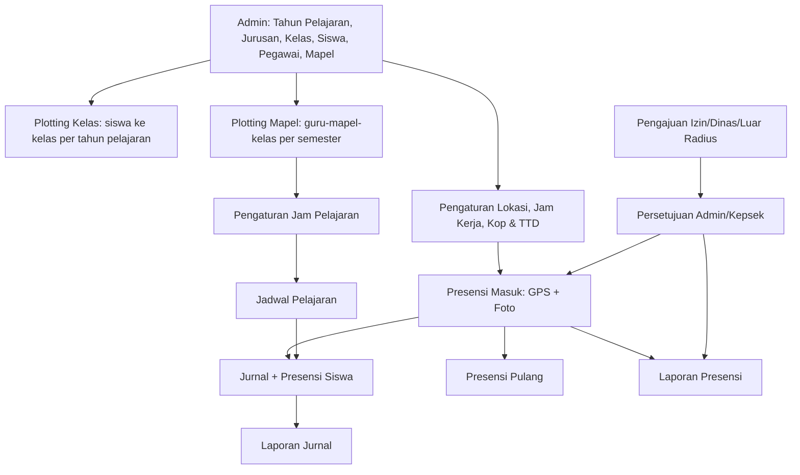
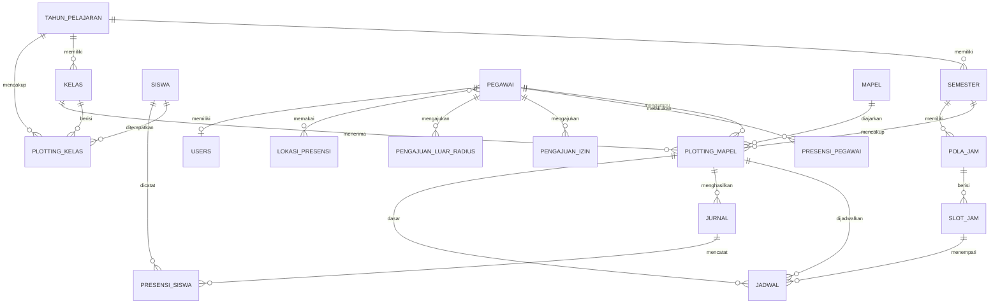

# SPESIFIKASI APLIKASI SIPANDU
### Presensi Guru & Pegawai: SMK Islam Anharul Ulum

Versi: 1.2 (final draft; identitas SIPANDU & SMK Islam Anharul Ulum) · Bahasa antarmuka: Indonesia · Zona waktu default: `Asia/Jakarta` (dapat diubah di pengaturan)

---

## 0. PETUNJUK UNTUK AGENT (BACA DULU)

Dokumen ini adalah **sumber kebenaran tunggal** (single source of truth) untuk membangun aplikasi. Ikuti aturan kerja berikut:

1. Baca seluruh dokumen sebelum menulis kode. Bagian **6 (Aturan Bisnis)** dan **7 (Model Data)** bersifat mengikat; jika ada konflik dengan bagian lain, Bagian 6 dan 7 yang menang.
2. Kerjakan **per fase** sesuai Bagian 11. Selesaikan dan uji satu fase sebelum fase berikutnya. Jangan membangun fitur dari fase yang belum diminta.
3. Setiap aturan diberi ID (mis. `BR-12`, `FR-JRN-03`). Gunakan ID tersebut pada komentar kode, nama test, dan pesan commit agar mudah dilacak.
4. Jangan menambah fitur di luar dokumen ini. Fitur yang **sengaja tidak dibuat** tercantum di Bagian 12.
5. Jika ada hal yang ambigu atau belum ditentukan, gunakan **Asumsi Default** (Bagian 13) dan catat di file `CATATAN-KEPUTUSAN.md`. Jangan berhenti untuk bertanya kecuali benar-benar menghalangi.
6. Semua teks antarmuka, pesan error, dan label laporan memakai **Bahasa Indonesia**. Nama tabel/kolom/kode memakai format yang tertulis di Bagian 7.
7. Setiap fase wajib menyertakan: migrasi database, seeder data contoh, validasi sisi server, dan test otomatis untuk aturan bisnis yang relevan.
8. Keamanan adalah syarat, bukan tambahan: semua otorisasi dicek di **server**, bukan hanya disembunyikan di UI.
9. **Dua repositori:** backend `https://github.com/fikrudzulfahmi/au-backend.git` (Laravel 12, PHP 8.3, MySQL) dan frontend `https://github.com/fikrudzulfahmi/au-frontend.git` (Vite). Periksa isi kedua repo lebih dulu dan ikuti Bagian 3. Jika repo sudah berisi kode, pertahankan konvensinya.
10. **Referensi desain:** gaya mobile mengikuti tangkapan layar yang disebut di 5.22 (bottom menu dengan tombol tengah melayang, kartu "Presensi & Kinerja", grid layanan berikon pastel). Tiru gaya, bukan merek. Desktop memakai sidebar.
11. Fitur baru pada versi ini: **Info Sekolah (5.18), Tampilan TV (5.19), Pengumuman (5.20), Landing Page (5.21), Tema UI (5.22)**.

---

## 1. RINGKASAN PRODUK

### Identitas

| Item | Nilai |
|---|---|
| **Nama aplikasi** | **SIPANDU** |
| **Sekolah** | **SMK Islam Anharul Ulum** |
| Alamat | Jl. Pondok No. 17, RT 02 RW 01, Dusun Sukosari, Desa Plumpungrejo, Kecamatan Kademangan, Kabupaten Blitar, Provinsi Jawa Timur |
| Zona waktu | `Asia/Jakarta` (WIB) |

Aturan pemakaian nama:
- Nama **SIPANDU** dipakai pada: judul tab/`<title>`, nama PWA (`name` dan `short_name` di manifest), logo teks pada login/landing/sidebar/TV, judul dokumen/ekspor yang memuat nama aplikasi, nama paket (`composer.json` / `package.json`), `VITE_APP_NAME`, dan `APP_NAME` di backend.
- **Nama sekolah** dan alamat **tidak ditulis permanen di kode**: keduanya berasal dari **Info Sekolah** (5.18) dan diisi lewat seeder awal (Bagian 10), sehingga dapat diubah admin.
- Kepanjangan SIPANDU belum ditetapkan; tampilkan hanya "SIPANDU" dan tagline dari Info Sekolah (default pada Bagian 10) sampai pemilik proyek menetapkannya.

Aplikasi web responsif (PWA, mobile-first) untuk SMK yang mencatat:

- **Presensi masuk dan pulang** guru dan pegawai struktural, dengan **geotag (GPS)** dan **foto selfie** dari kamera langsung.
- **Jurnal pembelajaran** guru yang sekaligus memuat **presensi siswa** per sesi mengajar.
- **Pengajuan izin/sakit/dinas/cuti** dan **pengajuan presensi di luar radius**, dengan persetujuan admin.
- **Laporan resmi** (presensi dan jurnal) dalam PDF/Excel dengan kop surat dan tanda tangan yang dapat diatur.
- **Tampilan TV** publik (akses dengan kode TV atau NPSN) yang menampilkan rekap presensi, pengisian jurnal, perizinan, serta pengumuman dan pengingat hari ini.
- **Info sekolah** (nama, NPSN, kepala sekolah, alamat, media sosial, dll.) dan **landing page** publik.
- Antarmuka **mobile dengan bottom menu** (tema mengikuti referensi) dan **desktop dengan sidebar**.

Tujuan: menghilangkan titip absen, mendokumentasikan kegiatan mengajar, dan menyediakan laporan siap cetak.

---

## 2. PERAN PENGGUNA

Satu pengguna dapat memiliki lebih dari satu peran (tabel `role_user`).

| Kode peran | Keterangan | Otomatis dari |
|---|---|---|
| `admin` | Operator/Super admin. Mengelola semua master data, pengaturan, persetujuan. Boleh tidak terhubung ke data pegawai. | Dibuat manual |
| `kepala_sekolah` | Melihat dashboard dan semua laporan, boleh menyetujui pengajuan. | Dibuat manual |
| `wakasek_kurikulum` | Mengelola plotting mapel dan jadwal, melihat laporan jurnal dan presensi. | Dibuat manual |
| `guru` | Presensi, jadwal, jurnal, presensi siswa, pengajuan. | `pegawai.jenis_pegawai = 'guru'` |
| `pegawai_struktural` | Presensi masuk/pulang dan pengajuan (tanpa jurnal). | `pegawai.jenis_pegawai = 'struktural'` |

**Wali kelas** bukan peran terpisah. Seorang guru adalah wali kelas jika ia tercatat sebagai `kelas.wali_kelas_id` pada tahun pelajaran aktif; ia mendapat akses tambahan melihat rekap presensi siswa kelasnya.

### Matriks akses

Keterangan: **K** = kelola (tambah/ubah/hapus/isi), **L** = hanya lihat, **S** = hanya data milik sendiri, **-** = tidak ada akses.

| Fitur | admin | kepala_sekolah | wakasek_kurikulum | guru | pegawai_struktural |
|---|:-:|:-:|:-:|:-:|:-:|
| Master data (TP, kelas, siswa, pegawai, mapel) | K | L | L | - | - |
| Plotting Kelas (siswa) | K | L | L | - | - |
| Plotting Mapel | K | L | K | L(S) | - |
| Pengaturan jam pelajaran | K | L | K | - | - |
| Jadwal pelajaran | K | L | K | L(S) | - |
| Presensi masuk/pulang | - | K(S)* | K(S)* | K(S) | K(S) |
| Pengajuan izin/dinas/luar radius | - | K(S)* | K(S)* | K(S) | K(S) |
| Persetujuan pengajuan & presensi luar radius | K | K | - | - | - |
| Jurnal + presensi siswa | K** | - | - | K(S) | - |
| Laporan presensi pegawai | K | L | L | L(S) | L(S) |
| Laporan jurnal & presensi siswa | K | L | L | L(S) | - |
| Rekap presensi siswa kelas wali | - | - | - | L (kelas wali) | - |
| Pengaturan sistem, lokasi, kop & TTD, reset perangkat | K | - | - | - | - |
| Info sekolah, pengaturan landing & layar TV | K | - | - | - | - |
| Pengumuman & pengingat (kelola) | K | K | - | L | L |
| Layar TV `/tv` dan landing `/` | publik (TV memakai kode TV/NPSN) | | | | |

\* Jika kepala sekolah/wakasek juga terdaftar sebagai pegawai.
\** Admin dapat mengoreksi jurnal/presensi siswa; setiap koreksi dicatat di `audit_log`.

---

## 3. ARSITEKTUR & TEKNOLOGI

### 3.1 Dua repositori

| Repo | URL | Isi |
|---|---|---|
| **Backend** | https://github.com/fikrudzulfahmi/au-backend.git | REST API: Laravel 12, PHP 8.3, MySQL |
| **Frontend** | https://github.com/fikrudzulfahmi/au-frontend.git | SPA berbasis Vite: landing page, aplikasi (mobile & desktop), layar TV |

Aturan kerja pada kedua repo:
- **Periksa isi repo terlebih dahulu.** Jika sudah ada kode/struktur/konvensi, pertahankan dan sesuaikan. Jika kosong, inisialisasi sesuai bagian ini. Jangan menimpa pekerjaan yang sudah ada tanpa alasan tertulis di `CATATAN-KEPUTUSAN.md`.
- Backend adalah **sumber kebenaran** untuk validasi dan otorisasi. Frontend hanya klien (menyembunyikan menu bukan pengganti otorisasi server).
- Urutan kerja tiap fase: migrasi + model → endpoint + test (backend) → halaman UI (frontend). Perubahan kontrak API harus tercermin pada dokumentasi OpenAPI dan tipe frontend **dalam PR yang sama**.
- Cabang: `main` (stabil), `develop`, dan cabang fitur `fase-N/<nama-fitur>`; satu PR per fase/fitur besar. Pesan commit menyertakan ID aturan (mis. `feat(presensi): validasi radius [BR-11]`).
- Tidak ada rahasia (password, kunci, `.env`) yang di-commit. Sediakan `.env.example` dan `README.md` (cara instalasi, menjalankan, menguji) di **kedua** repo.

### 3.2 Stack

| Lapisan | Pilihan |
|---|---|
| Backend | **Laravel 12**, **PHP 8.3**, **MySQL 8** (`InnoDB`, `utf8mb4`), mode API saja |
| Autentikasi API | Laravel Sanctum, **personal access token (Bearer)**; repo dan domain frontend/backend terpisah |
| Validasi & respons | Form Request, API Resource, Policy/Gate, middleware `role` |
| Dokumentasi API | OpenAPI otomatis (mis. `dedoc/scramble`) |
| Olah gambar | Intervention Image v3 (kompresi, resize, watermark) |
| Ekspor | `barryvdh/laravel-dompdf` (PDF, template Blade), Laravel Excel / PhpSpreadsheet versi terbaru yang kompatibel Laravel 12 |
| Antrean & jadwal | Queue driver `database`, Laravel Scheduler (pembersihan foto, dll.); cache `database`/`file` (Redis tidak wajib) |
| Uji & kualitas | Pest, Laravel Pint, GitHub Actions (CI) |
| Frontend | **Vite** + **React 18 + TypeScript** (lihat A-13), React Router, TanStack Query, Axios, react-hook-form + zod |
| Gaya | Tailwind CSS, font *Plus Jakarta Sans* (self-host via `@fontsource`), ikon `lucide-react` |
| Peta, grafik | `react-leaflet` + OpenStreetMap; Recharts |
| PWA | `vite-plugin-pwa` (manifest, ikon, service worker, `start_url=/dashboard`) |
| Kamera & GPS | Browser API `getUserMedia`, `navigator.geolocation` (wajib HTTPS) |
| Kualitas FE | ESLint, Prettier, `tsc --strict`, Vitest (komponen/utilitas kritis), GitHub Actions |

### 3.3 Topologi & lingkungan

- Produksi memakai dua subdomain berbeda, mis. `api.<domain>` (backend) dan `app.<domain>` (frontend), keduanya **HTTPS**.
- Backend `.env` minimal: `APP_URL`, `FRONTEND_URL` (untuk CORS), `DB_*`, `APP_TIMEZONE=Asia/Jakarta`, `FILESYSTEM_DISK=local`, pengaturan Sanctum. Frontend `.env`: `VITE_API_BASE_URL`, `VITE_APP_NAME=SIPANDU`; backend `APP_NAME=SIPANDU`.
- CORS hanya mengizinkan origin `FRONTEND_URL`; header yang diizinkan mencakup `Authorization`, `X-Device-Token`, `Accept`, `Content-Type`.
- Struktur penyimpanan foto: `storage/app/private/presensi/{tahun_pelajaran}/{yyyy-mm}/{pegawai_id}_{tanggal}_{masuk|pulang}.jpg`. Berkas tidak publik; disajikan lewat **URL bertanda tangan sementara** (`temporarySignedRoute`, masa berlaku ± 5 menit) yang dibuat oleh endpoint terotorisasi.

### 3.4 Konvensi API

- Prefix `/api/v1`. JSON. Header: `Authorization: Bearer <token>`, `Accept: application/json`, `X-Device-Token: <token perangkat>`.
- Daftar: `{ "data": [...], "meta": { "page", "per_page", "total" } }`; satu objek: `{ "data": {...} }`.
- Error: `401` tidak terautentikasi, `403` tidak berwenang, `404`, `409` konflik aturan bisnis (mis. jadwal bentrok) dengan `{ "message", "code" }`, `422` validasi dengan `{ "message", "errors": { "field": ["..."] } }`. Pesan dalam Bahasa Indonesia.
- Waktu: ISO 8601 dengan offset zona; `GET /api/v1/waktu-server` mengembalikan waktu server agar jam di UI (dan layar TV) **disinkronkan dengan server**, bukan jam perangkat.
- Pembatasan laju (rate limit): login 5/menit/IP; `POST /tv/masuk` 5/menit/IP; `GET /tv/rekap` 20/menit/token; endpoint lain bawaan wajar.
- Kelompok endpoint (nama final ditentukan agent, konsisten dan terdokumentasi):

| Kelompok | Contoh | Akses |
|---|---|---|
| `auth` | `POST /auth/login`, `POST /auth/logout`, `GET /auth/me`, `POST /auth/ganti-password` | login |
| `master` | `/tahun-pelajaran`, `/kelas`, `/siswa`, `/pegawai`, `/mapel`, `/jurusan`, `/hari-libur` | admin (L untuk kepsek/wakasek) |
| `plotting` | `/plotting-kelas`, `/plotting-kelas/naik-kelas/pratinjau`, `/plotting-kelas/naik-kelas/eksekusi`, `/plotting-mapel` | admin, wakasek |
| `akademik` | `/pola-jam`, `/jadwal` | admin, wakasek |
| `presensi` | `POST /presensi/masuk`, `POST /presensi/pulang`, `GET /presensi/hari-ini`, `GET /presensi/riwayat` | pegawai |
| `pengajuan` | `/pengajuan-izin`, `/pengajuan-luar-radius`, `PATCH .../putuskan` | pegawai; admin/kepsek memutuskan |
| `jurnal` | `/jurnal`, `/jurnal/sesi-hari-ini`, `/jurnal/{id}/presensi-siswa` | guru |
| `monitoring` | `/monitoring/presensi-harian` | admin, kepsek, wakasek |
| `laporan` | `/laporan/...` (JSON) dan `.../ekspor?format=pdf|xlsx` | sesuai Bagian 2 |
| `pengaturan` | `/pengaturan/lokasi`, `/jam-kerja`, `/sekolah`, `/penandatangan`, `/tv`, `/audit-log` | admin |
| `pengumuman` | `/pengumuman` (aktif), `/pengumuman/kelola` | semua login; kelola: admin, kepsek |
| `publik` | `GET /publik/sekolah`, `GET /publik/pengumuman` | tanpa login |
| `tv` | `POST /tv/masuk`, `GET /tv/rekap`, `POST /tv/keluar` | publik / token TV |

### 3.5 Struktur kode yang disarankan

**Backend:** `app/Http/Controllers/Api/V1/*`, `app/Http/Requests/*`, `app/Http/Resources/*`, `app/Policies/*`, `app/Services/*` (`PresensiService`, `GeofenceService`, `FotoService`, `JadwalValidator`, `NaikKelasService`, `LaporanService`, `TvRekapService`), `app/Console/Commands/*` (`presensi:bersihkan-foto`), `resources/views/laporan/*` (template PDF), `database/migrations|seeders|factories`, `tests/Feature|Unit`.

**Frontend:** `src/app` (router, provider), `src/layouts` (`MobileLayout` + `BottomNav`, `DesktopLayout` + `Sidebar` + `TopBar`, `PublicLayout`, `TvLayout`), `src/features/<modul>` (halaman, hook query, komponen, skema zod), `src/components/ui` (komponen dasar), `src/lib` (api client, auth, waktu server, geofence util, kompresi foto), `src/assets/ilustrasi`, `src/styles/tokens.css`.

---

## 4. ALUR BESAR



---

## 5. SPESIFIKASI FITUR

### 5.1 Data Tahun Pelajaran (`FR-TP`)

Struktur dua tingkat: **Tahun Pelajaran** (mis. 2026/2027) berisi dua **Semester** (Ganjil, Genap).

- `FR-TP-01` CRUD tahun pelajaran: nama (format `YYYY/YYYY`), tanggal mulai, tanggal selesai.
- `FR-TP-02` Setiap tahun pelajaran otomatis memiliki 2 semester (Ganjil, Genap) dengan tanggal mulai/selesai yang dapat diubah.
- `FR-TP-03` Status tahun pelajaran: `draft`, `aktif`, `selesai`. Hanya **satu** tahun pelajaran dan **satu** semester yang aktif (`BR-01`).
- `FR-TP-04` Aksi **Aktifkan**: mengaktifkan tahun pelajaran dan semester terpilih; yang lain menjadi nonaktif.
- `FR-TP-05` Aksi **Tandai Selesai**: tahun pelajaran menjadi `selesai` (read-only untuk data transaksi) dan memicu aturan retensi foto (`BR-30`).
- `FR-TP-06` **Salin dari semester sebelumnya** untuk: plotting mapel, pola/jam pelajaran, jadwal (opsi dipilih admin).
- `FR-TP-07` Data **Hari Libur** (tanggal, keterangan; dapat rentang) per tahun pelajaran. Dipakai untuk menghitung hari kerja dan alpa (`BR-24`).

### 5.2 Data Kelas (`FR-KLS`)

- `FR-KLS-01` Master **Jurusan/Kompetensi Keahlian** (kode, nama), mis. TKJ, RPL, AKL.
- `FR-KLS-02` CRUD **Kelas** per tahun pelajaran: nama (mis. `X TKJ 1`), tingkat (`X`, `XI`, `XII`), jurusan, wali kelas (guru).
- `FR-KLS-03` Satu guru hanya boleh menjadi wali kelas **satu** kelas pada satu tahun pelajaran (`BR-02`).
- `FR-KLS-04` Kelas dibuat per tahun pelajaran (kelas dengan nama sama di tahun berbeda adalah record berbeda). Tersedia aksi **Salin kelas dari tahun pelajaran lain** dengan penyesuaian tingkat (X→XI, XI→XII; kelas XII tidak disalin).
- `FR-KLS-05` Kelas yang sudah memiliki jurnal tidak boleh dihapus (hanya dinonaktifkan).

### 5.3 Data Siswa (`FR-SIS`)

- `FR-SIS-01` CRUD siswa: NIS, NISN, nama, jenis kelamin, tempat & tanggal lahir, tahun masuk, status.
- `FR-SIS-02` Status siswa: `aktif`, `lulus`, `pindah`, `keluar`. Status berubah otomatis melalui proses Plotting Kelas (5.7) atau manual oleh admin.
- `FR-SIS-03` **Import Excel/CSV** dengan template yang dapat diunduh; validasi per baris, laporan baris gagal, NIS unik.
- `FR-SIS-04` Export daftar siswa ke Excel.
- `FR-SIS-05` Pencarian dan filter (kelas pada TP aktif, status, jurusan, tingkat).
- `FR-SIS-06` Siswa yang sudah punya presensi tidak boleh dihapus (hanya ubah status).

### 5.4 Data Guru & Pegawai (`FR-PEG`)

Guru dan pegawai struktural berada dalam **satu tabel `pegawai`**, dibedakan dengan `jenis_pegawai`.

- `FR-PEG-01` CRUD: NIP/NUPTK/ID internal, nama, jenis kelamin, `jenis_pegawai` (`guru` | `struktural`), jabatan (teks bebas, mis. Kepala TU, Bendahara), status kepegawaian (`PNS`, `PPPK`, `GTY`, `GTT`, `Honorer`, `Lainnya`), email, no. HP, foto profil, status aktif.
- `FR-PEG-02` Setiap pegawai dapat dibuatkan akun login (username default = NIP/ID, password awal acak yang wajib diganti saat login pertama).
- `FR-PEG-03` Import Excel/CSV; export Excel.
- `FR-PEG-04` **Lokasi presensi per pegawai**: admin memilih satu atau lebih lokasi dari master lokasi (5.10) untuk setiap pegawai. Tanpa pilihan khusus, pegawai memakai lokasi bertanda **default** (`BR-12`).
- `FR-PEG-05` **Reset perangkat**: admin dapat mengosongkan perangkat terdaftar milik pengguna (`BR-14`).
- `FR-PEG-06` Reset password oleh admin.

### 5.5 Data Mapel (`FR-MPL`)

- `FR-MPL-01` CRUD mapel: kode (unik), nama, kelompok (`umum` | `kejuruan` | `muatan_lokal`), jurusan terkait (opsional, untuk mapel kejuruan).
- `FR-MPL-02` Import dan export Excel.
- `FR-MPL-03` Mapel yang sudah dipakai di plotting tidak boleh dihapus (hanya nonaktif).

### 5.6 Plotting Mapel (`FR-PLM`)

Menetapkan **guru pengampu** untuk setiap **mapel** pada setiap **kelas** per **semester**.

- `FR-PLM-01` Satu baris = (semester, guru, mapel, kelas, JP per minggu).
- `FR-PLM-02` Untuk satu (semester, mapel, kelas) hanya boleh ada **satu** guru (`BR-03`).
- `FR-PLM-03` Hanya pegawai `jenis_pegawai = 'guru'` yang dapat dipilih sebagai pengampu.
- `FR-PLM-04` Tampilan: (a) matriks kelas × mapel, (b) daftar per guru dengan **total JP per minggu**.
- `FR-PLM-05` Fitur **salin plotting** dari semester lain.
- `FR-PLM-06` Penghapusan plotting yang sudah dipakai jadwal diblokir; harus hapus jadwalnya dulu.
- `FR-PLM-07` Total JP jadwal tidak boleh melebihi `jp_per_minggu` plotting (`BR-09`).

### 5.7 Plotting Kelas / Rombel Siswa (`FR-PLK`)

**Definisi:** Plotting Kelas adalah penempatan **siswa ke kelas pada setiap tahun pelajaran**, termasuk proses **naik kelas, tinggal kelas, kelulusan**, serta mutasi siswa. (Bukan penugasan guru; wali kelas diatur di Data Kelas.)

**Aturan dasar**
- Seorang siswa aktif hanya boleh berada di **satu kelas** pada satu tahun pelajaran (`BR-04`).
- Penempatan bersifat per **tahun pelajaran** (berlaku untuk kedua semester).
- Riwayat plotting setiap siswa dari tahun ke tahun harus tersimpan utuh.

**Fitur**
- `FR-PLK-01` **Plotting siswa baru (kelas X)**: pilih tahun pelajaran → daftar siswa belum terplot → pilih siswa (centang massal/filter) → pilih kelas tujuan. Tersedia juga import Excel (NIS, nama kelas).
- `FR-PLK-02` **Wizard Naik Kelas / Kelulusan** (proses akhir tahun):
  1. Pilih **tahun pelajaran asal** (yang selesai) dan **tahun pelajaran tujuan** (harus sudah ada dan kelas-kelasnya sudah dibuat).
  2. Pilih **kelas asal** (satu, beberapa, atau semua).
  3. Sistem menampilkan seluruh siswa kelas asal dengan **status akhir default**: tingkat X → `naik_kelas`; tingkat XI → `naik_kelas`; tingkat XII → `lulus`.
  4. Admin dapat mengubah status akhir per siswa (atau massal) menjadi: `naik_kelas`, `tinggal_kelas`, `lulus`, `pindah`, `keluar`.
  5. Admin memetakan **kelas asal → kelas tujuan** (sistem memberi saran: tingkat +1 dan jurusan sama untuk `naik_kelas`; tingkat sama untuk `tinggal_kelas`). Pemetaan dapat diubah **per siswa**.
  6. **Pratinjau** ringkasan (jumlah naik, tinggal, lulus, pindah, keluar per kelas) lalu **Konfirmasi**.
  7. Eksekusi dalam **satu transaksi database**: membuat baris `plotting_kelas` tahun tujuan untuk `naik_kelas` dan `tinggal_kelas`; memperbarui `status_akhir` baris tahun asal; mengubah `siswa.status` untuk `lulus`/`pindah`/`keluar` (mengisi `tanggal_status` dan tahun lulus); mencatat `audit_log`.
- `FR-PLK-03` Wizard boleh dijalankan bertahap per kelas dan **idempotent**: siswa yang sudah diproses tidak diproses ulang; sistem menandai kelas yang sudah selesai.
- `FR-PLK-04` Validasi: kelas tujuan harus berada di tahun pelajaran tujuan; tingkat kelas tujuan harus sesuai status (naik: tingkat +1; tinggal: tingkat sama); kelas XII tidak dapat `naik_kelas`.
- `FR-PLK-05` **Mutasi kelas** dalam tahun berjalan: pindahkan siswa dari kelas A ke kelas B (tingkat apa pun, alasan wajib diisi). Data presensi siswa yang sudah tercatat tetap melekat pada jurnal/kelas lamanya.
- `FR-PLK-06` **Batalkan** hasil proses naik kelas untuk satu siswa/kelas selama tahun pelajaran tujuan belum memiliki jurnal bagi siswa tersebut (mengembalikan `siswa.status` dan menghapus plotting tujuan).
- `FR-PLK-07` Siswa dengan status `lulus`, `pindah`, `keluar` tidak muncul di daftar plotting/presensi tahun berikutnya, tetapi riwayatnya tetap dapat dilihat.
- `FR-PLK-08` Tampilan: daftar siswa per kelas (jumlah, L/P), riwayat kelas per siswa, daftar siswa belum terplot.
- `FR-PLK-09` Export daftar siswa per kelas (Excel/PDF dengan kop).

### 5.8 Pengaturan Jam Pelajaran (`FR-JAM`)

- `FR-JAM-01` Per semester, admin membuat satu atau lebih **Pola Jam** (mis. "Senin–Kamis", "Jumat", "Sabtu"). Setiap pola memilih hari berlaku; satu hari hanya boleh masuk ke satu pola dalam satu semester (`BR-05`).
- `FR-JAM-02` Setiap pola berisi urutan slot: `urutan`, tipe (`pelajaran` | `istirahat` | `kegiatan`), label, jam mulai, jam selesai, dan `jam_ke` (angka, hanya untuk tipe `pelajaran`).
- `FR-JAM-03` Validasi: slot tidak boleh tumpang tindih; jam mulai < jam selesai; `jam_ke` unik dan berurutan dalam satu pola.
- `FR-JAM-04` Salin pola jam dari semester lain.
- `FR-JAM-05` Slot yang sudah dipakai jadwal tidak boleh dihapus/diubah jam ke-nya tanpa konfirmasi (perubahan jam mulai/selesai diperbolehkan).

### 5.9 Jadwal Pelajaran (`FR-JDW`)

- `FR-JDW-01` Satu entri jadwal = (semester, hari, slot jam pelajaran, plotting mapel). Sesi dua/tiga jam diinput sebagai beberapa entri berurutan.
- `FR-JDW-02` **Validasi bentrok otomatis** (ditolak di server dan diberi pesan jelas):
  - Guru tidak boleh mengajar dua kelas pada hari+slot yang sama (`BR-06`).
  - Kelas tidak boleh memiliki dua mapel pada hari+slot yang sama (`BR-07`).
  - Pegawai/guru yang mengajar pada hari+slot yang sama dengan jadwal lain tidak boleh disimpan walau beda kelas.
- `FR-JDW-03` Hanya slot bertipe `pelajaran` dari pola jam hari terkait yang dapat dijadwalkan (`BR-08`).
- `FR-JDW-04` Tampilan grid: per kelas, per guru, per hari. Sel kosong dapat diklik untuk menambah jadwal.
- `FR-JDW-05` Ekspor/cetak jadwal (PDF dengan kop; Excel).
- `FR-JDW-06` Guru melihat **jadwal hari ini** dan jadwal mingguan miliknya di beranda.
- `FR-JDW-07` Sistem menampilkan peringatan (bukan blokir) bila JP terjadwal < `jp_per_minggu` plotting.

### 5.10 Lokasi & Aturan Presensi (`FR-LOK`)

- `FR-LOK-01` Master **Lokasi Presensi**: nama, latitude, longitude, **radius (meter)**, status aktif, penanda **default**. Dapat memilih titik dengan peta (klik/drag marker) atau input koordinat. Dapat lebih dari satu lokasi.
- `FR-LOK-02` Hanya satu lokasi yang bertanda default (`BR-12`).
- `FR-LOK-03` **Penetapan lokasi per pegawai** dilakukan di Data Pegawai (`FR-PEG-04`), mendukung penetapan massal (pilih banyak pegawai → pilih lokasi).
- `FR-LOK-04` **Jam Kerja** per `jenis_pegawai` dan per hari: hari kerja (ya/tidak), `buka_presensi` (jam presensi masuk mulai dibuka), `jam_masuk`, `jam_pulang`. Contoh: guru Senin–Kamis 07.00–15.00, Jumat 07.00–11.30.
- `FR-LOK-05` Pengaturan teknis (tabel `pengaturan`): `gps_max_akurasi_m` (default 50), `foto_max_sisi_px` (default 800), `foto_kualitas_jpeg` (default 65), `foto_target_maks_kb` (default 150).
- `FR-LOK-06` Radius tidak di-hardcode; seluruh nilai dapat diubah admin tanpa deploy ulang.

### 5.11 Presensi Masuk & Pulang (`FR-PRS`)

**Alur pegawai (mobile)**
1. Login dari **perangkat terdaftar** (`BR-14`).
2. Beranda menampilkan status hari ini dan tombol **Presensi Masuk** (atau **Presensi Pulang** setelah masuk).
3. Aplikasi meminta izin lokasi dan kamera; menampilkan pratinjau kamera depan, indikator akurasi GPS, dan **jarak ke lokasi terdekat**.
4. Pegawai mengambil foto selfie **langsung dari kamera** (tanpa memilih dari galeri). Foto dikompres di sisi klien.
5. Kirim. Server memvalidasi dan menyimpan memakai **waktu server**.

**Fitur**
- `FR-PRS-01` Presensi masuk satu kali per hari per pegawai; presensi pulang satu kali setelah presensi masuk (`BR-10`).
- `FR-PRS-02` Data yang disimpan per presensi: waktu server, latitude, longitude, akurasi (m), lokasi terdekat/terpilih, jarak ke lokasi (m), foto, status, status validasi, keterangan.
- `FR-PRS-03` Status masuk: `hadir` atau `terlambat` — **tanpa toleransi**: terlambat bila waktu server > `jam_masuk` (`BR-15`). Menit terlambat dihitung dan disimpan.
- `FR-PRS-04` Status pulang: `normal` atau `pulang_cepat` bila waktu server < `jam_pulang` (`BR-16`); menit pulang cepat dihitung.
- `FR-PRS-05` Pegawai yang belum presensi pulang pada akhir hari ditandai `tidak_presensi_pulang` di laporan.
- `FR-PRS-06` **Verifikasi radius** memakai rumus Haversine terhadap lokasi pegawai (`BR-11`):
  - Jika akurasi GPS lebih buruk dari `gps_max_akurasi_m` → presensi **tidak dikirim**; pegawai diminta mencoba lagi (bukan dianggap luar radius).
  - Jika jarak ke salah satu lokasi pegawai ≤ radius → **valid** (`validasi = valid`).
  - Jika di luar semua radius → lihat alur luar radius di bawah.
- `FR-PRS-07` **Presensi luar radius — dua jalur** (`BR-17`):
  - **Jalur A, pengajuan terlebih dahulu**: pegawai mengajukan *Presensi Luar Radius* (tanggal atau rentang tanggal + alasan + lampiran opsional, mis. surat tugas). Setelah disetujui admin, pada tanggal tersebut presensi di luar radius langsung berstatus `disetujui` (otomatis, merujuk ke pengajuan).
  - **Jalur B, langsung presensi**: jika tidak ada pengajuan, sistem tetap menerima presensi tetapi berstatus `menunggu` dan pegawai diminta mengisi alasan. Admin menyetujui (`disetujui`) atau menolak (`ditolak`).
  - Presensi `menunggu` belum dihitung hadir di rekap sampai disetujui. Status masuk (`hadir`/`terlambat`) tetap dihitung dari **waktu presensi dikirim**, bukan waktu persetujuan (`BR-18`).
  - Jika `ditolak`, pegawai boleh presensi ulang pada hari yang sama; record lama disimpan di `audit_log`.
- `FR-PRS-08` **Foto**: wajib; hanya dari kamera; di klien diperkecil (sisi terpanjang `foto_max_sisi_px`) dan dikompres JPEG; di server **dikompres ulang** dan diberi **watermark** (nama, tanggal-jam server, koordinat); target ukuran ≤ `foto_target_maks_kb` (`BR-29`).
- `FR-PRS-09` Pada hari pengajuan izin/sakit/cuti yang disetujui, tombol presensi tidak ditampilkan dan hari itu tidak dihitung alpa (`BR-25`). Pada hari **dinas** yang disetujui, presensi tetap dilakukan.
- `FR-PRS-10` Halaman **Monitoring Harian** (admin/kepsek/wakasek): daftar semua pegawai aktif dengan status hari ini (belum presensi, hadir, terlambat, izin/sakit/dinas/cuti, menunggu persetujuan, luar radius); klik untuk melihat foto, peta, dan detail.
- `FR-PRS-11` **Daftar Persetujuan Presensi Luar Radius** (admin): lihat foto + peta + alasan, setujui/tolak dengan catatan, dukung aksi massal.
- `FR-PRS-12` Riwayat presensi milik sendiri (pegawai).
- `FR-PRS-13` Koreksi manual presensi oleh admin (mis. lupa pulang, gangguan sistem) wajib disertai alasan dan tercatat di `audit_log`; data koreksi ditandai `dikoreksi_admin = true`.

### 5.12 Pengajuan Izin / Sakit / Dinas / Cuti (`FR-IZN`)

- `FR-IZN-01` Pegawai mengajukan: jenis (`izin` | `sakit` | `dinas` | `cuti`), tanggal mulai, tanggal selesai, alasan, lampiran (foto/PDF; contoh surat dokter, surat tugas).
- `FR-IZN-02` Untuk jenis `dinas`, tersedia kotak centang **"Presensi dari luar radius"**. Jika pengajuan disetujui dan kotak dicentang, sistem otomatis membuat pengajuan luar radius yang disetujui untuk setiap hari kerja pada rentang tanggal tersebut (`BR-17`).
- `FR-IZN-03` Status: `menunggu`, `disetujui`, `ditolak`, `dibatalkan` (pembatalan oleh pegawai hanya saat masih `menunggu`).
- `FR-IZN-04` Penyetuju: `admin` atau `kepala_sekolah`; catatan penyetuju opsional (wajib saat menolak).
- `FR-IZN-05` Pengajuan tidak boleh bertumpuk tanggal dengan pengajuan lain yang `menunggu`/`disetujui` untuk pegawai yang sama.
- `FR-IZN-06` Pengajuan **Presensi Luar Radius** mandiri (tanpa izin/dinas) tersedia sebagai formulir terpisah (tanggal/rentang + alasan + lampiran opsional).
- `FR-IZN-07` Pada hari izin/sakit/cuti/dinas yang disetujui, sesi jadwal mengajar guru tampil sebagai **"Berhalangan"** dan **tidak dihitung** sebagai jurnal belum diisi di laporan kepatuhan (`BR-26`).
- `FR-IZN-08` Admin dapat membuat pengajuan atas nama pegawai (langsung berstatus `disetujui`), misalnya bila pegawai tidak sempat mengajukan.
- `FR-IZN-09` Pegawai melihat riwayat dan status pengajuannya.

### 5.13 Jurnal Pembelajaran + Presensi Siswa (`FR-JRN`)

**Alur guru**
1. Beranda menampilkan **jadwal mengajar hari ini** dengan status jurnal tiap sesi (Belum / Sudah / Berhalangan).
2. Guru memilih sesi → **Isi Jurnal** (diblokir bila belum presensi masuk, `BR-19`).
3. Mengisi jurnal dan presensi siswa dalam **satu halaman**, lalu simpan.

**Fitur**
- `FR-JRN-01` Sesi jurnal terbentuk dari jadwal: entri jadwal berurutan untuk plotting mapel dan hari yang sama digabung menjadi **satu sesi** (mis. jam ke-1 s.d. 3 = satu jurnal).
- `FR-JRN-02` Bidang jurnal: tanggal, kelas, mapel, jam ke (mulai–selesai) [otomatis dari jadwal], **materi/topik** (wajib), **kegiatan pembelajaran** (wajib), **catatan/kendala** (opsional), **foto kegiatan** (opsional, dikompres, maksimal 3 foto).
- `FR-JRN-03` **Presensi siswa** pada halaman yang sama: daftar siswa kelas pada tahun pelajaran tersebut (berdasarkan Plotting Kelas), default **Hadir**; guru hanya mengubah yang tidak hadir menjadi **Sakit (S)**, **Izin (I)**, atau **Alpa (A)** dengan keterangan opsional. Ringkasan jumlah H/S/I/A tampil real-time. Tombol "Semua Hadir".
- `FR-JRN-04` **Syarat presensi**: jurnal untuk tanggal T hanya dapat **dibuat** jika pegawai memiliki presensi masuk pada tanggal T dengan validasi `valid`, `disetujui`, atau `menunggu`. Jika belum presensi atau presensi `ditolak`, server menolak dan UI menampilkan pesan "Lakukan presensi masuk terlebih dahulu" (`BR-19`).
- `FR-JRN-05` **Edit jurnal tanpa batas waktu** oleh guru pemilik (`BR-20`). Setiap perubahan dicatat di `audit_log` (siapa, kapan, nilai lama-baru ringkas).
- `FR-JRN-06` Guru hanya dapat mengisi jurnal untuk sesi pada jadwalnya. Jurnal untuk tanggal lampau diizinkan bila pada tanggal tersebut guru memiliki presensi masuk yang memenuhi `FR-JRN-04`.
- `FR-JRN-07` Satu sesi hanya satu jurnal (unik per plotting mapel + tanggal + jam mulai) (`BR-21`).
- `FR-JRN-08` Siswa yang ditampilkan: siswa berstatus `aktif` yang terplot di kelas tersebut pada tahun pelajaran jurnal (`BR-22`).
- `FR-JRN-09` Riwayat jurnal milik sendiri dengan filter periode/kelas/mapel.
- `FR-JRN-10` Wali kelas dapat melihat **rekap presensi siswa kelasnya** (per siswa, per periode: H/S/I/A dan persentase).

### 5.14 Laporan (`FR-LAP`)

Semua laporan: filter periode (hari ini, minggu ini, bulan, rentang tanggal), tampil di web, **ekspor PDF dan Excel**, memakai **kop surat dan blok tanda tangan** dari pengaturan (5.15). Laporan resmi (PDF) memuat judul, periode, tanggal cetak, dan penandatangan.

**A. Laporan Presensi**
- `FR-LAP-01` **Rekap presensi pegawai** (per periode, per jenis pegawai/pegawai): jumlah hadir, terlambat (jumlah & total menit), pulang cepat, tidak presensi pulang, izin, sakit, dinas, cuti, alpa, luar radius (disetujui), persentase kehadiran.
- `FR-LAP-02` **Detail presensi harian per pegawai**: tanggal, jam masuk, jam pulang, status, jarak, lokasi, status validasi, keterangan. Versi web menampilkan tautan foto dan peta.
- `FR-LAP-03` **Presensi harian (semua pegawai)** untuk tanggal tertentu.
- `FR-LAP-04` **Rekap izin/sakit/dinas/cuti** per periode.
- `FR-LAP-05` **Rekap presensi luar radius** (disetujui/ditolak/menunggu).
- `FR-LAP-06` **Rekap presensi siswa** (dari jurnal): per kelas × periode, per siswa (H/S/I/A, persentase), dapat difilter per mapel. Untuk wali kelas dibatasi kelasnya.

**B. Laporan Jurnal**
- `FR-LAP-07` **Daftar jurnal**: tanggal, jam ke, kelas, mapel, guru, materi, kegiatan, ringkasan H/S/I/A. Filter periode/guru/kelas/mapel.
- `FR-LAP-08` **Rekap kepatuhan jurnal per guru**: jumlah sesi terjadwal (hari kerja non-libur), jurnal terisi, belum terisi, berhalangan, persentase. Daftar rinci sesi yang belum terisi.
- `FR-LAP-09` **Rekap jam mengajar terlaksana** per guru (jumlah JP terlaksana per periode).

**Aturan laporan**
- `FR-LAP-10` Hitungan alpa dan hari kerja mengikuti `BR-24`/`BR-25`.
- `FR-LAP-11` Laporan memakai data tahun pelajaran/semester yang dipilih (default: aktif).
- `FR-LAP-12` Pembatasan data per peran mengikuti Bagian 2.

### 5.15 Pengaturan Kop Surat & Tanda Tangan (`FR-KOP`)

- `FR-KOP-01` **Profil sekolah**: data diambil dari **Info Sekolah** (5.18); kop hanya menambah pengaturan tampilan (baris teks kop dan posisi logo).
- `FR-KOP-02` **Kop surat** (dapat disunting): baris 1–3 teks atas (mis. nama pemerintah provinsi, dinas pendidikan, nama sekolah), alamat dan kontak di bawah, garis pembatas ganda; posisi logo kiri/kanan dapat diaktifkan/dinonaktifkan.
- `FR-KOP-03` **Penandatangan** (banyak data, dapat dipilih per laporan, maksimal 2 per dokumen): jabatan, nama, NIP, gambar tanda tangan (opsional, PNG transparan), gambar stempel (opsional).
- `FR-KOP-04` Pengaturan tata letak tanda tangan: **kota dan tanggal penetapan** (otomatis tanggal cetak atau manual), posisi (kanan/kiri/dua kolom), apakah menampilkan "Mengetahui".
- `FR-KOP-05` Tersedia **pratinjau** kop dan blok tanda tangan sebelum disimpan.
- `FR-KOP-06` Kop dan penandatangan dipakai konsisten pada semua laporan PDF dan dokumen cetak (jadwal, daftar siswa per kelas).

### 5.16 Pengguna, Perangkat & Keamanan (`FR-SEC`)

- `FR-SEC-01` Login username + password; password di-hash (bcrypt/argon2); pembatasan percobaan login (mis. 5 kali, kunci 5 menit).
- `FR-SEC-02` **Satu akun satu perangkat** (`BR-14`): pada login pertama oleh pegawai, sistem membuat **token perangkat** acak yang disimpan di perangkat (penyimpanan lokal PWA, dikirim pada setiap request lewat header `X-Device-Token`) dan **hash-nya** di tabel `perangkat_pengguna`. Login dari perangkat lain ditolak dengan pesan "Akun ini terdaftar pada perangkat lain. Hubungi admin untuk reset perangkat." Admin dapat reset (`FR-PEG-05`); pendaftaran ulang terjadi pada login berikutnya.
- `FR-SEC-03` Akun `admin` yang tidak terhubung ke data pegawai dikecualikan dari pembatasan perangkat.
- `FR-SEC-04` Pengguna dapat mengganti password sendiri; password awal wajib diganti.
- `FR-SEC-05` `audit_log` untuk: login gagal, reset perangkat, koreksi presensi, persetujuan/penolakan, proses naik kelas, perubahan jurnal, perubahan pengaturan.
- `FR-SEC-06` Proteksi CSRF, XSS, validasi unggahan (tipe & ukuran), file disajikan lewat route yang mengecek hak akses.
- `FR-SEC-07` HTTPS wajib pada produksi (diperlukan untuk kamera dan GPS).
- `FR-SEC-08` Batasan teknis yang harus **dituliskan di dokumentasi**: pada aplikasi web, deteksi *fake GPS* tidak mungkin sempurna. Mitigasi: kombinasi akurasi GPS, foto kamera langsung, pengikatan perangkat, watermark, dan tinjauan admin atas data luar radius.

### 5.17 Dashboard (`FR-DSH`)

- `FR-DSH-01` **Pegawai/Guru**: kartu *Presensi & Kinerja* (jam datang, jam pulang, gauge menit kerja; 5.22), status presensi hari ini, jadwal hari ini + status jurnal, ringkasan bulan ini (hadir, terlambat, izin), status pengajuan terakhir.
- `FR-DSH-02` **Admin/Kepsek/Wakasek**: jumlah pegawai hadir/belum/terlambat/izin/dinas hari ini, antrean persetujuan (pengajuan + presensi luar radius), jurnal belum terisi hari ini, grafik kehadiran 30 hari.

### 5.18 Info Sekolah & Pengaturan Umum (`FR-SCH`)

Satu instalasi = satu sekolah; data info sekolah bersifat tunggal (singleton).

- `FR-SCH-01` Formulir **Info Sekolah**: nama sekolah*, **NPSN*** (8 digit angka), status sekolah (Negeri/Swasta), akreditasi, tagline, **nama kepala sekolah***, NIP kepala sekolah, alamat (jalan + RT/RW, dusun, desa/kelurahan, kecamatan, kabupaten/kota, provinsi, kode pos), telepon, email, website, **media sosial** (Instagram, Facebook, YouTube, TikTok, X, WhatsApp), tentang sekolah, visi, misi, logo utama, logo kedua (kanan kop), favicon, foto sampul (opsional).
- `FR-SCH-02` Info sekolah menjadi sumber data untuk: kop laporan (5.15), landing page (5.21), layar TV (5.19), judul/ikon aplikasi, dan footer.
- `FR-SCH-03` Tombol **"Jadikan penandatangan default"** membuat/memperbarui penandatangan "Kepala Sekolah" dari nama dan NIP pada info sekolah.
- `FR-SCH-04` Validasi: NPSN wajib 8 digit; URL media sosial/website divalidasi; logo/foto dikompres otomatis (maksimal 1 MB sebelum kompresi, hasil ≤ 300 KB).
- `FR-SCH-05` Tab **Landing Page** pada halaman yang sama: aktif/nonaktif landing, judul hero, tampilkan peta, tampilkan pengumuman.
- `FR-SCH-06` Hanya admin yang dapat mengubah; perubahan dicatat di `audit_log`.

### 5.19 Tampilan TV: Rekap Hari Ini (`FR-TV`)

Layar publik berformat 16:9 untuk ditampilkan di TV/monitor sekolah (browser mode layar penuh), memuat rekap hari ini secara otomatis tanpa interaksi.

**Akses**
- `FR-TV-01` Halaman publik `/tv`. Tanpa login pengguna.
- `FR-TV-02` Pengguna memasukkan **kode TV** (kode khusus acak 8 karakter yang dibuat sistem dan dapat diganti admin) **atau NPSN sekolah** (bila opsi "izinkan NPSN" aktif; default aktif). Alternatif: tautan langsung `/tv?kode=XXXXXXXX` (parameter dihapus dari URL setelah berhasil masuk).
- `FR-TV-03` Setelah kode benar, server menerbitkan **token TV** read-only (masa berlaku default 30 hari) yang disimpan di perangkat TV, sehingga TV tidak perlu memasukkan kode lagi setelah dinyalakan ulang. Kode salah berulang (5×/menit/IP) dikunci sementara (`BR-32`).
- `FR-TV-04` Token TV **hanya** berlaku untuk endpoint `tv`; tidak dapat dipakai untuk API lain (`BR-32`).

**Tata letak (lihat wireframe 8.4)**
- `FR-TV-05` **Header:** logo dan nama sekolah, nama kepala sekolah, jam digital besar (detik, disinkronkan waktu server), tanggal lengkap (hari Indonesia), dan **indikator jam pelajaran berlangsung** ("Jam ke-3 · 09.15–10.00 · sisa 22 menit" / "Istirahat" / "Di luar jam pelajaran" / "Hari libur: …").
- `FR-TV-06` **Kolom kiri: Presensi Hari Ini.** Ringkasan angka (hadir, terlambat, belum presensi, izin/sakit/dinas/cuti) dengan cincin persentase kehadiran; daftar pegawai yang sudah presensi, urut terbaru (inisial/avatar huruf, nama, jam masuk, lencana status hadir/terlambat); panel bergantian ke daftar **Belum Presensi** setiap N detik.
- `FR-TV-07` **Kolom tengah: Rekap Pengisian Jurnal.** Cincin persentase jurnal terisi hari ini (sesi terisi ÷ sesi yang sudah dimulai/lewat, **tidak** menghitung sesi "Berhalangan"); daftar sesi yang sedang berlangsung (kelas, mapel, guru, status Sudah/Belum); daftar **guru yang belum mengisi jurnal** untuk sesi yang sudah lewat; ringkasan presensi siswa hari ini (jumlah dan persentase H/S/I/A).
- `FR-TV-08` **Kolom kanan: Perizinan Hari Ini.** Jumlah per jenis (izin, sakit, dinas, cuti) dan daftar pegawai (nama, jenis, "sampai tanggal"). Alasan tidak ditampilkan kecuali opsi `tv_tampilkan_alasan_izin` diaktifkan (default mati).
- `FR-TV-09` **Panel tambahan** di bawah kolom kanan, berotasi: **Pengumuman & Pengingat** (kartu bergantian, yang `penting` lebih lama/menonjol), **Ulang tahun hari ini** (opsional), dan **agenda/hari libur terdekat**.
- `FR-TV-10` **Footer:** teks berjalan (marquee) dari pengumuman bertipe `teks_berjalan`, alamat dan media sosial sekolah.

**Perilaku**
- `FR-TV-11` Data diambil dengan **polling** `GET /api/v1/tv/rekap` (default 30 detik, dapat diatur 10–120 detik). Satu respons agregat memuat seluruh kolom (lihat bentuk data di bawah). Respons di-cache server selama 15 detik (`TvRekapService`) agar banyak TV tidak membebani database.
- `FR-TV-12` Jika koneksi gagal, layar **tetap menampilkan data terakhir** dengan indikator "terputus" kecil, mencoba ulang dengan jeda bertahap; saat pulih indikator hilang.
- `FR-TV-13` Daftar panjang di-scroll otomatis (kecepatan dapat diatur); berhenti bila daftar muat layar.
- `FR-TV-14` Layar tidak tidur (Wake Lock API bila tersedia), kursor tersembunyi setelah 3 detik tanpa gerak, tombol/tekan `F` untuk layar penuh, muat ulang otomatis sekali setelah pukul 00:05 untuk berganti tanggal.
- `FR-TV-15` Tema `terang` atau `gelap` dan skala font `normal`/`besar`/`ekstra besar` (untuk TV jarak jauh) sesuai pengaturan.

**Pengaturan admin (`/pengaturan/tv`)**
- `FR-TV-16` Aktif/nonaktif layar TV; lihat dan **buat ulang kode TV** (membuat ulang kode mencabut semua sesi TV, `BR-35`); izinkan NPSN; interval refresh; tema; skala font; tampilkan alasan izin; tampilkan ulang tahun; durasi rotasi panel; masa berlaku token; daftar **sesi TV aktif** (nama perangkat, terakhir aktif, IP) dengan tombol cabut; tombol **Pratinjau**.

**Privasi**
- `FR-TV-17` TV **tidak** menampilkan: foto selfie presensi, koordinat, NIP, nomor HP, alasan sakit, atau data pribadi siswa. Siswa hanya ditampilkan sebagai agregat (`BR-33`). Avatar pegawai berupa huruf inisial.

**Bentuk data respons `GET /tv/rekap` (ringkas)**
```json
{
  "data": {
    "waktu_server": "2026-07-06T10:26:08+07:00",
    "sekolah": { "nama": "", "npsn": "", "kepala_sekolah": "", "logo_url": "", "alamat": "", "media_sosial": {} },
    "jam_pelajaran": { "status": "pelajaran|istirahat|di_luar|libur", "label": "Jam ke-3", "mulai": "09:15", "selesai": "10:00", "sisa_menit": 22 },
    "presensi": {
      "ringkas": { "total": 0, "hadir": 0, "terlambat": 0, "belum": 0, "izin": 0, "sakit": 0, "dinas": 0, "cuti": 0, "persen_hadir": 0 },
      "sudah": [ { "nama": "", "jenis": "guru|struktural", "jam_masuk": "07:01:12", "status": "hadir|terlambat" } ],
      "belum": [ { "nama": "", "jenis": "" } ]
    },
    "jurnal": {
      "ringkas": { "sesi_berjalan": 0, "terisi": 0, "belum": 0, "berhalangan": 0, "persen_terisi": 0 },
      "sesi_sekarang": [ { "kelas": "", "mapel": "", "guru": "", "jam_ke": "3-4", "status": "sudah|belum|berhalangan" } ],
      "guru_belum_isi": [ { "guru": "", "kelas": "", "mapel": "", "jam_ke": "" } ],
      "siswa_hari_ini": { "H": 0, "S": 0, "I": 0, "A": 0 }
    },
    "perizinan": { "ringkas": { "izin": 0, "sakit": 0, "dinas": 0, "cuti": 0 }, "daftar": [ { "nama": "", "jenis": "", "sampai": "2026-07-08", "alasan": null } ] },
    "pengumuman": [ { "id": 0, "tipe": "pengumuman|pengingat|teks_berjalan", "prioritas": "normal|penting", "judul": "", "isi": "", "gambar_url": null } ],
    "ulang_tahun": [ { "nama": "" } ],
    "agenda": [ { "tanggal": "", "keterangan": "" } ]
  }
}
```

### 5.20 Pengumuman & Pengingat (`FR-PMN`)

- `FR-PMN-01` CRUD pengumuman: judul, isi (ringkas, maksimal 280 karakter untuk tampilan TV; isi panjang opsional di aplikasi), **tipe** (`pengumuman` | `pengingat` | `teks_berjalan`), prioritas (`normal` | `penting`), tanggal mulai–selesai tayang, jam tayang (opsional), **target tampil** (aplikasi pegawai, layar TV, landing page), gambar (opsional, dikompres), status aktif.
- `FR-PMN-02` Hanya `admin` dan `kepala_sekolah` yang dapat mengelola. Semua pengguna login melihat pengumuman aktif pada beranda aplikasi (carousel) dan halaman `/pengumuman`.
- `FR-PMN-03` Pengumuman tayang bila `is_active` dan sekarang berada dalam rentang tanggal (dan jam, bila diisi) (`BR-36`); yang kedaluwarsa otomatis tidak tampil tetapi tidak dihapus.
- `FR-PMN-04` **Pengingat otomatis sistem** pada TV/beranda (tanpa input admin): libur besok (dari `hari_libur`), pegawai ulang tahun hari ini (bila diaktifkan; memakai `pegawai.tanggal_lahir`).
- `FR-PMN-05` Contoh penggunaan: "Rapat dewan guru Jumat 13.00", "Mohon isi jurnal setiap selesai mengajar", "Pembagian rapor tanggal …".

### 5.21 Landing Page (`FR-LND`)

Halaman publik `/` pada repo frontend, tanpa login, memperkenalkan aplikasi dan sekolah. Tema dan identitas visual sama dengan aplikasi (5.22).

- `FR-LND-01` **Navbar:** logo dan nama sekolah, tautan anchor (Fitur, Cara Kerja, Tentang, Kontak), tombol **Masuk**; tautan kecil ke `/tv`.
- `FR-LND-02` **Hero:** judul default **"SIPANDU — Presensi & Jurnal Digital SMK Islam Anharul Ulum"** (nama sekolah diambil dari Info Sekolah; dapat diubah di pengaturan landing), tagline, tombol **Masuk** dan **Pasang Aplikasi** (muncul bila PWA dapat dipasang), ilustrasi guru khaki dan mockup tampilan HP.
- `FR-LND-03` **Fitur:** kartu ikon bulat pastel (sama dengan gaya grid layanan): Presensi GPS + foto, Presensi pulang, Jurnal & presensi siswa, Izin/dinas online, Laporan resmi PDF/Excel, Layar TV rekap harian.
- `FR-LND-04` **Cara kerja:** 4 langkah bernomor (Masuk ke aplikasi → Presensi di sekolah → Mengajar dan isi jurnal → Pantau laporan).
- `FR-LND-05` **Pengumuman terbaru** (hanya yang bertanda `tampil_landing`; bagian disembunyikan bila kosong atau dinonaktifkan).
- `FR-LND-06` **Tentang sekolah:** tentang, visi, misi, nama kepala sekolah (dari info sekolah).
- `FR-LND-07` **Kontak & lokasi:** alamat, telepon, email, ikon media sosial (tautan), peta Leaflet titik sekolah (opsional).
- `FR-LND-08` **Footer:** hak cipta, nama sekolah, versi aplikasi.
- `FR-LND-09` Data dari `GET /publik/sekolah` dan `GET /publik/pengumuman`; bila belum diisi, tampilkan teks placeholder yang rapi.
- `FR-LND-10` Landing **tidak** menampilkan data pegawai, siswa, atau angka kehadiran (`BR-34`).
- `FR-LND-11` Performa: JS awal landing dipisah (route-based code splitting), gambar lazy-load, target Lighthouse performa mobile ≥ 90; meta tag dasar dan OpenGraph (statis); tanpa SSR.
- `FR-LND-12` Responsif penuh (mobile, tablet, desktop). Pengguna yang sudah login dan membuka `/` tetap melihat landing dengan tombol **Buka Aplikasi**.

### 5.22 Tema & Desain Antarmuka (`FR-UI`)

**Referensi visual:** tangkapan layar aplikasi kepegawaian *SIKEPO* (diunggah pemilik proyek; simpan salinannya di `docs/referensi/` pada repo frontend). Tiru **gaya, tata letak, dan nuansa warna**, **bukan** logo, nama, atau merek SIKEPO. Ganti dengan identitas **SIPANDU** (nama aplikasi) dan **SMK Islam Anharul Ulum** (sekolah).

**Aturan umum**
- `FR-UI-01` **Mobile** (lebar < 1024 px) memakai **bottom menu**; **desktop** (≥ 1024 px) memakai **sidebar**. Tidak ada sidebar di mobile dan tidak ada bottom menu di desktop. Tablet mengikuti layout mobile.
- `FR-UI-02` Satu sistem desain (token warna, radius, bayangan, tipografi) dipakai di landing, aplikasi, dan TV.
- `FR-UI-03` Semua halaman memakai komponen bersama dan terbaca di layar 360 px; target sentuh minimal 44 px; kontras teks memenuhi WCAG AA; hormati `prefers-reduced-motion`.
- `FR-UI-04` Mode gelap tidak diwajibkan pada aplikasi (hanya TV yang memiliki tema gelap).

**Layout mobile (meniru referensi)**
- `FR-UI-05` Latar layar **biru muda** penuh. Area kepala beranda: logo sekolah di kiri atas; di bawahnya **nama pegawai** (huruf kapital, tebal, besar, maksimal 3 baris); **jabatan/status** (mis. "Guru · GTY" atau jabatan struktural) dalam teks abu-biru; **chip NIP** berbentuk pil dengan ikon orang. **Ilustrasi guru animasi berseragam khaki** di sisi kanan, tampak "mengintip" dari tepi kartu.
- `FR-UI-06` Kartu putih membulat besar **"Presensi & Kinerja"** menimpa bagian bawah kepala beranda:
  - Baris atas: **hari, tanggal, jam:menit:detik** yang berjalan (disinkronkan waktu server) dalam huruf kecil abu-biru.
  - Judul **Presensi & Kinerja** (tebal); **lencana** pil kanan atas (mis. "GURU" / "HARI KERJA" / "LIBUR" / "TERLAMBAT").
  - Kiri: **Jam Datang** (ikon jam dalam lingkaran hijau) dan **Jam Pulang** (ikon jam dalam lingkaran merah) berformat `HH:MM:SS`; `00:00:00` bila belum presensi.
  - Kanan: **gauge setengah lingkaran bersegmen** berisi persentase besar dan teks `X / Y` serta label **Menit Kerja**. `Y` = durasi jam kerja hari ini (`jam_pulang − jam_masuk`, dalam menit); `X` = menit kerja berjalan sejak jam datang (berhenti di jam pulang bila sudah presensi pulang) (A-20).
- `FR-UI-07` Bagian **"Layanan Lainnya"** dengan tautan biru **"Lihat Semua ›"** (menuju `/layanan`), berisi kartu putih membulat dengan **grid 4 kolom ikon bulat berwarna pastel** (hijau, biru, oranye, kuning) dengan label di bawahnya. Fitur yang belum aktif diberi lencana oranye **"Segera"**. Isi layanan sesuai peran:
  - Guru: Jadwal, Jurnal, Izin, Riwayat, Rekap Saya, Luar Radius, Pengumuman, (Wali Kelas bila berlaku).
  - Pegawai struktural: Izin, Riwayat, Rekap Saya, Luar Radius, Pengumuman.
  - Kepala sekolah/wakasek: Monitoring, Persetujuan (kepsek), Laporan, Jadwal (wakasek), Pengumuman.
  - Admin: Persetujuan, Monitoring, Laporan, Master Data, Plotting, Pengaturan, Pengumuman.
- `FR-UI-08` Di bawah layanan: carousel **Pengumuman** dan (untuk guru) kartu **Jadwal Hari Ini** dengan status jurnal.
- `FR-UI-09` **Bottom menu** 5 slot dengan **tombol tengah melayang** (lihat 8.2):
  - Latar bar putih dengan **lekuk cekung (notch)** di tengah tempat tombol melayang; tombol tengah berupa **lingkaran biru tua** berukuran ± 64 px dengan **ikon sidik jari** putih, menonjol di atas bar.
  - Item aktif: ikon dan label **biru tua**; item tidak aktif: ikon abu-biru **tanpa label** (seperti referensi).
  - Mematuhi `safe-area-inset-bottom`; disembunyikan saat keyboard terbuka dan pada halaman presensi/kamera penuh layar.
- `FR-UI-10` **Tombol tengah (Presensi)** berubah status: *Masuk* (belum presensi), *Pulang* (sudah masuk), *Selesai* (centang, nonaktif). Bagi admin non-pegawai, tombol tengah menjadi **Persetujuan** (ikon centang) dengan lencana jumlah antrean.
- `FR-UI-11` Halaman presensi, kamera, dan jurnal dibuka sebagai halaman penuh dengan tombol kembali, bukan modal kecil.

**Layout desktop**
- `FR-UI-12` **Sidebar kiri** tetap (lebar ± 264 px; dapat diciutkan menjadi ± 76 px berikon saja): logo + nama sekolah di atas, menu berkelompok menurut peran (lihat 8.3), item aktif berlatar biru muda dengan teks biru tua dan penanda, profil pengguna + keluar di bawah.
- `FR-UI-13` **Top bar**: judul halaman/breadcrumb, jam live, lonceng antrean persetujuan (admin/kepsek), menu pengguna.
- `FR-UI-14` Area konten berlatar biru muda lembut dengan **kartu putih** radius besar; tabel dengan header lembut, filter di atas, aksi ikon, paginasi; formulir dua kolom. Beranda desktop menampilkan kartu *Presensi & Kinerja* yang sama + kartu statistik + pengumuman.
- `FR-UI-15` Halaman berat (master data, grid jadwal, laporan) tetap dapat dibuka di mobile: tabel dirender sebagai **daftar kartu** atau digulir horizontal pada kontainernya sendiri.

**Token desain** (perkiraan dari gambar referensi; boleh disetel, simpan sebagai CSS variables/tema Tailwind)

| Token | Nilai awal | Pemakaian |
|---|---|---|
| `--bg-app` | `#CFE3F1` | latar mobile / area konten |
| `--bg-surface` | `#FFFFFF` | kartu |
| `--text-strong` | `#0F2D3F` | judul, nama |
| `--text-muted` | `#6B8296` | label, tanggal |
| `--primary` | `#1E2A8A` | tombol tengah, item aktif |
| `--link` | `#2646B0` | tautan "Lihat Semua" |
| `--success` | `#2BA84A` | jam datang, hadir |
| `--danger` | `#D93A3A` | jam pulang, alpa |
| `--warn-bg` / `--warn-text` | `#FDEBD3` / `#E8801B` | lencana oranye, "Segera" |
| Pastel ikon | hijau `#D3EAD6`, biru `#9FD0F7`, oranye `#F8A56A`, kuning `#FCDF84` | lingkaran ikon layanan |
| Radius | kartu 28 px, kontrol 16 px, pil 999 px | |
| Bayangan | `0 8px 24px rgba(15,45,63,.08)` | kartu |
| Font | Plus Jakarta Sans 400/500/600/700/800; nama pegawai 800 kapital 28–32 px; angka jam `tabular-nums` 700 | |

**Warna status** (lencana): hadir hijau, terlambat oranye, izin biru, sakit ungu, dinas toska, cuti abu, alpa merah, menunggu kuning.

**Aset ilustrasi guru**
- `FR-UI-16` Ilustrasi **guru animasi (kartun/flat vector) berseragam khaki** yang menarik dan ramah: kemeja khaki dengan papan nama/emblem kecil, senyum, pose mengintip dari tepi kartu atau memegang buku; **latar transparan**, rasio ± 3:4.
- `FR-UI-17` Sediakan 1 set berisi 2–3 karakter guru (mis. guru laki-laki, guru perempuan, guru perempuan berhijab) sebagai satu gambar grup untuk beranda, serta varian tunggal. Berkas `src/assets/ilustrasi/guru-khaki-*.svg` (atau `.webp` transparan), ukuran masing-masing ≤ 150 KB. Dipakai pada beranda mobile, hero landing page, dan halaman login.
- `FR-UI-18` Aset dibuat/dilisensikan pemilik proyek (bukan karakter berhak cipta pihak lain). **Sampai aset siap, pakai placeholder** (lingkaran inisial/ilustrasi sederhana) tanpa memblokir pengerjaan; lokasi aset mudah diganti.

**Komponen bersama yang harus dibuat:** `AppShell`, `BottomNav` (dengan notch + tombol tengah), `Sidebar`, `TopBar`, `PresensiKinerjaCard`, `GaugeMenitKerja`, `LayananGrid`/`LayananIcon`, `PageHeader`, `StatCard`, `DataTable` (+ varian kartu mobile), `StatusBadge`, `EmptyState`, `ConfirmDialog`, `Toast`, `CameraCapture`, `GpsStatus`, `MapPicker`, `FormField`, `Carousel`, `ProgressRing`.

---

## 6. ATURAN BISNIS (MENGIKAT)

| ID | Aturan |
|---|---|
| BR-01 | Hanya satu tahun pelajaran dan satu semester berstatus aktif pada satu waktu. |
| BR-02 | Satu guru maksimal menjadi wali kelas satu kelas per tahun pelajaran. |
| BR-03 | Unik (semester, mapel, kelas) pada `plotting_mapel` — satu guru pengampu. |
| BR-04 | Unik (tahun_pelajaran, siswa) pada `plotting_kelas` — satu siswa satu kelas per tahun pelajaran. |
| BR-05 | Satu hari hanya masuk satu pola jam dalam satu semester. |
| BR-06 | Guru tidak boleh punya dua jadwal pada (semester, hari, slot) yang sama. |
| BR-07 | Kelas tidak boleh punya dua jadwal pada (semester, hari, slot) yang sama. |
| BR-08 | Hanya slot bertipe `pelajaran` yang dapat dijadwalkan. |
| BR-09 | Jumlah entri jadwal sebuah plotting tidak boleh melebihi `jp_per_minggu`-nya. |
| BR-10 | Satu presensi masuk per pegawai per hari; presensi pulang hanya setelah masuk dan satu kali per hari. |
| BR-11 | Radius dicek terhadap seluruh lokasi milik pegawai; valid bila jarak ke salah satunya ≤ radius lokasi itu. Jarak dihitung dengan Haversine. |
| BR-12 | Pegawai tanpa lokasi khusus memakai lokasi `is_default = true`. Hanya satu lokasi default. |
| BR-13 | Waktu presensi selalu memakai waktu server, tidak pernah waktu perangkat. |
| BR-14 | Satu akun pegawai hanya dapat dipakai dari satu perangkat terdaftar; reset hanya oleh admin. |
| BR-15 | Terlambat bila waktu masuk server > `jam_masuk` hari tersebut; **tidak ada toleransi**. Menit terlambat = selisih dibulatkan ke atas. |
| BR-16 | Pulang cepat bila waktu pulang server < `jam_pulang` hari tersebut. |
| BR-17 | Presensi luar radius: Jalur A (pengajuan disetujui sebelumnya → langsung `disetujui`) atau Jalur B (presensi langsung → `menunggu` sampai admin memutuskan). Dinas yang disetujui dengan opsi luar radius otomatis membuat pengajuan luar radius disetujui. |
| BR-18 | Status hadir/terlambat ditentukan dari waktu presensi dikirim, bukan waktu persetujuan. Presensi `menunggu` belum dihitung hadir; `ditolak` dihitung tidak hadir. |
| BR-19 | Jurnal tanggal T hanya bisa dibuat bila pegawai memiliki presensi masuk tanggal T berstatus validasi `valid`/`disetujui`/`menunggu`. |
| BR-20 | Jurnal dapat diedit kapan pun oleh pemiliknya tanpa batas waktu; setiap edit tercatat. |
| BR-21 | Unik (plotting_mapel, tanggal, jam_ke_mulai) pada `jurnal`. |
| BR-22 | Daftar siswa pada presensi siswa = siswa `aktif` terplot di kelas itu pada tahun pelajaran jurnal. |
| BR-23 | Status presensi siswa hanya: `H`, `S`, `I`, `A`. |
| BR-24 | **Hari kerja** = hari dengan `jam_kerja.is_hari_kerja = true` untuk jenis pegawainya dan bukan `hari_libur`. **Alpa** = hari kerja yang sudah lewat, pegawai aktif, tanpa presensi masuk bervalidasi dan tanpa izin/sakit/cuti/dinas disetujui. Alpa dihitung saat membuat laporan (tidak disimpan). |
| BR-25 | Pada hari izin/sakit/cuti disetujui, presensi tidak diwajibkan dan tombol disembunyikan; hari itu bukan alpa. Dinas disetujui tetap melakukan presensi. |
| BR-26 | Sesi mengajar pada hari izin/sakit/cuti/dinas disetujui berstatus "Berhalangan" dan dikecualikan dari hitungan jurnal belum terisi. |
| BR-27 | Data transaksi pada tahun pelajaran berstatus `selesai` bersifat read-only, kecuali koreksi admin yang tercatat. |
| BR-28 | Tidak ada notifikasi WhatsApp atau integrasi eksternal (Dapodik, dll.). |
| BR-29 | Foto presensi: kamera langsung saja, dikompres klien dan server, target ≤ `foto_target_maks_kb` (default 150 KB), diberi watermark. |
| BR-30 | **Retensi foto**: foto presensi dan lampiran disimpan selama satu tahun pelajaran. Setelah tahun pelajaran berstatus `selesai`, tugas terjadwal `presensi:bersihkan-foto` menghapus **file** foto dan lampiran tahun pelajaran tersebut (kolom path diisi `NULL`, ditandai `foto_dihapus_pada`). Data teks presensi (waktu, koordinat, status) tetap disimpan. Admin dapat menjalankan pembersihan manual setelah konfirmasi. |
| BR-31 | Operasi destruktif (hapus, proses naik kelas, reset) memerlukan konfirmasi dan dicatat di `audit_log`. |
| BR-32 | Layar TV dapat dibuka dengan **kode TV** atau **NPSN** (jika `tv_izinkan_npsn`). Kode benar → token TV read-only yang hanya berlaku untuk endpoint `tv`. Kode salah berulang dikunci sementara. TV nonaktif → semua akses ditolak. |
| BR-33 | Layar TV tidak menampilkan foto selfie presensi, koordinat, NIP, nomor HP, alasan sakit, atau data siswa individual (hanya agregat). Alasan izin hanya jika `tv_tampilkan_alasan_izin` aktif. |
| BR-34 | Landing page hanya menampilkan info sekolah dan pengumuman bertanda `tampil_landing`; tidak ada data pegawai, siswa, atau kehadiran. |
| BR-35 | Membuat ulang kode TV mencabut semua `tv_sesi`; token yang dicabut/kedaluwarsa ditolak. |
| BR-36 | Pengumuman tayang hanya bila `is_active` dan saat ini berada dalam rentang tanggal (dan jam jika diisi). |
| BR-37 | Seluruh hitungan pada layar TV memakai aturan yang sama dengan laporan (`BR-15`, `BR-18`, `BR-24`, `BR-25`, `BR-26`). |
| BR-38 | Jam di UI dan layar TV disinkronkan dengan waktu server (offset dari `/waktu-server`), bukan jam perangkat. |

---

## 7. MODEL DATA

Konvensi: kunci primer `id` (bigint unsigned auto-increment), `created_at`, `updated_at` pada semua tabel, `deleted_at` (soft delete) pada tabel master. Tanda `*` = wajib; `FK` = foreign key; `UQ` = unik.

### 7.1 Autentikasi & pengaturan

| Tabel | Kolom |
|---|---|
| `users` | `pegawai_id` FK→pegawai NULL (UQ), `username`* UQ, `password`*, `wajib_ganti_password` bool, `is_active` bool, `last_login_at` |
| `roles` | `kode`* UQ (`admin`, `kepala_sekolah`, `wakasek_kurikulum`, `guru`, `pegawai_struktural`), `nama` |
| `role_user` | `user_id` FK, `role_id` FK (UQ gabungan) |
| `perangkat_pengguna` | `user_id` FK UQ, `token_hash`*, `user_agent`, `terdaftar_pada`, `terakhir_dipakai` |
| `pengaturan` | `kunci`* UQ, `nilai`, `tipe` (string/int/bool/json) |
| `profil_sekolah` | lihat definisi lengkap di 7.6 |
| `penandatangan` | `jabatan`*, `nama`*, `nip`, `ttd_path`, `stempel_path`, `is_default` bool, `urutan` int, `is_active` bool |
| `pengaturan_ttd` | `kota_penetapan`, `mode_tanggal` (`otomatis`/`manual`), `tanggal_manual`, `posisi` (`kanan`/`kiri`/`dua_kolom`), `tampilkan_mengetahui` bool |
| `audit_log` | `user_id` FK NULL, `aksi`*, `objek_tipe`, `objek_id`, `data_lama` json, `data_baru` json, `ip`, `waktu`* |

### 7.2 Master akademik

| Tabel | Kolom |
|---|---|
| `tahun_pelajaran` | `nama`* UQ (`2026/2027`), `tanggal_mulai`*, `tanggal_selesai`*, `status`* (`draft`/`aktif`/`selesai`) |
| `semester` | `tahun_pelajaran_id`* FK, `jenis`* (`ganjil`/`genap`), `tanggal_mulai`, `tanggal_selesai`, `is_active` bool; UQ (tahun_pelajaran_id, jenis) |
| `hari_libur` | `tahun_pelajaran_id`* FK, `tanggal_mulai`*, `tanggal_selesai`*, `keterangan`* |
| `jurusan` | `kode`* UQ, `nama`* |
| `kelas` | `tahun_pelajaran_id`* FK, `nama`*, `tingkat`* (`X`/`XI`/`XII`), `jurusan_id`* FK, `wali_kelas_id` FK→pegawai NULL, `is_active` bool; UQ (tahun_pelajaran_id, nama) |
| `siswa` | `nis`* UQ, `nisn` UQ NULL, `nama`*, `jenis_kelamin`* (`L`/`P`), `tempat_lahir`, `tanggal_lahir`, `tahun_masuk`, `status`* (`aktif`/`lulus`/`pindah`/`keluar`), `tanggal_status`, `tahun_lulus` |
| `plotting_kelas` | `tahun_pelajaran_id`* FK, `siswa_id`* FK, `kelas_id`* FK, `status_akhir`* (`berjalan`/`naik_kelas`/`tinggal_kelas`/`lulus`/`pindah`/`keluar`, default `berjalan`), `plotting_sebelumnya_id` FK→plotting_kelas NULL, `catatan`; **UQ (tahun_pelajaran_id, siswa_id)** |
| `mutasi_kelas` | `plotting_kelas_id`* FK, `kelas_asal_id`* FK, `kelas_tujuan_id`* FK, `tanggal`*, `alasan`*, `dibuat_oleh` FK→users |
| `pegawai` | `nip`* UQ (atau ID internal), `nama`*, `jenis_kelamin`*, `tanggal_lahir`, `jenis_pegawai`* (`guru`/`struktural`), `jabatan`, `status_kepegawaian`* (`PNS`/`PPPK`/`GTY`/`GTT`/`Honorer`/`Lainnya`), `email`, `no_hp`, `foto_path`, `is_active` bool |
| `mapel` | `kode`* UQ, `nama`*, `kelompok`* (`umum`/`kejuruan`/`muatan_lokal`), `jurusan_id` FK NULL, `is_active` bool |
| `plotting_mapel` | `semester_id`* FK, `pegawai_id`* FK (guru), `mapel_id`* FK, `kelas_id`* FK, `jp_per_minggu`* int; **UQ (semester_id, mapel_id, kelas_id)** |

### 7.3 Jam & jadwal

| Tabel | Kolom |
|---|---|
| `pola_jam` | `semester_id`* FK, `nama`* |
| `pola_jam_hari` | `pola_jam_id`* FK, `semester_id`* FK, `hari`* tinyint (1=Senin … 7=Minggu); **UQ (semester_id, hari)** |
| `slot_jam` | `pola_jam_id`* FK, `urutan`* int, `tipe`* (`pelajaran`/`istirahat`/`kegiatan`), `label`*, `jam_mulai`*, `jam_selesai`*, `jam_ke` int NULL (wajib untuk `pelajaran`); UQ (pola_jam_id, urutan), UQ (pola_jam_id, jam_ke) |
| `jadwal` | `semester_id`* FK, `hari`*, `slot_jam_id`* FK, `plotting_mapel_id`* FK, `pegawai_id`* FK (denormalisasi), `kelas_id`* FK (denormalisasi); **UQ (semester_id, hari, slot_jam_id, pegawai_id)**, **UQ (semester_id, hari, slot_jam_id, kelas_id)** |

> Catatan: `pegawai_id` dan `kelas_id` pada `jadwal` disalin dari `plotting_mapel` dan **harus dijaga konsisten** (set saat simpan, tidak diedit langsung) agar constraint bentrok dapat ditegakkan di level database.

### 7.4 Presensi pegawai & pengajuan

| Tabel | Kolom |
|---|---|
| `lokasi_presensi` | `nama`*, `latitude`* decimal(10,7), `longitude`* decimal(10,7), `radius_m`* int, `is_default` bool, `is_active` bool |
| `pegawai_lokasi` | `pegawai_id`* FK, `lokasi_id`* FK; UQ gabungan |
| `jam_kerja` | `jenis_pegawai`* (`guru`/`struktural`), `hari`* (1–7), `is_hari_kerja`* bool, `buka_presensi` time, `jam_masuk` time, `jam_pulang` time; UQ (jenis_pegawai, hari) |
| `presensi_pegawai` | `pegawai_id`* FK, `tanggal`*, `semester_id` FK; **masuk:** `masuk_waktu`, `masuk_lat`, `masuk_lng`, `masuk_akurasi_m`, `masuk_lokasi_id` FK NULL, `masuk_jarak_m`, `masuk_foto_path` NULL, `masuk_status` (`hadir`/`terlambat`), `masuk_menit_terlambat` int, `masuk_validasi` (`valid`/`menunggu`/`disetujui`/`ditolak`), `masuk_alasan_luar_radius`, `masuk_pengajuan_luar_radius_id` FK NULL; **pulang:** `pulang_waktu`, `pulang_lat`, `pulang_lng`, `pulang_akurasi_m`, `pulang_lokasi_id` FK NULL, `pulang_jarak_m`, `pulang_foto_path` NULL, `pulang_status` (`normal`/`pulang_cepat`), `pulang_menit_cepat` int, `pulang_validasi`, `pulang_alasan_luar_radius`, `pulang_pengajuan_luar_radius_id` FK NULL; **umum:** `diputuskan_oleh` FK→users NULL, `diputuskan_pada`, `catatan_penyetuju`, `dikoreksi_admin` bool, `foto_dihapus_pada` NULL; **UQ (pegawai_id, tanggal)** |
| `pengajuan_izin` | `pegawai_id`* FK, `jenis`* (`izin`/`sakit`/`dinas`/`cuti`), `tanggal_mulai`*, `tanggal_selesai`*, `alasan`*, `lampiran_path` NULL, `presensi_luar_radius` bool (hanya `dinas`), `status`* (`menunggu`/`disetujui`/`ditolak`/`dibatalkan`), `diputuskan_oleh` FK→users NULL, `diputuskan_pada`, `catatan_penyetuju`, `dibuat_oleh_admin` bool, `lampiran_dihapus_pada` NULL |
| `pengajuan_luar_radius` | `pegawai_id`* FK, `tanggal`* (satu baris per tanggal), `alasan`*, `lampiran_path` NULL, `pengajuan_izin_id` FK NULL, `status`* (`menunggu`/`disetujui`/`ditolak`/`dibatalkan`), `diputuskan_oleh`, `diputuskan_pada`, `catatan_penyetuju`; UQ (pegawai_id, tanggal) |

### 7.5 Jurnal & presensi siswa

| Tabel | Kolom |
|---|---|
| `jurnal` | `semester_id`* FK, `plotting_mapel_id`* FK, `pegawai_id`* FK, `kelas_id`* FK, `tanggal`*, `jam_ke_mulai`* int, `jam_ke_selesai`* int, `materi`*, `kegiatan`*, `catatan`, `dibuat_oleh` FK→users, `diubah_oleh` FK→users NULL; **UQ (plotting_mapel_id, tanggal, jam_ke_mulai)** |
| `jurnal_foto` | `jurnal_id`* FK, `foto_path`*, `urutan`, `foto_dihapus_pada` NULL |
| `presensi_siswa` | `jurnal_id`* FK, `siswa_id`* FK, `status`* (`H`/`S`/`I`/`A`), `keterangan`; **UQ (jurnal_id, siswa_id)** |

### 7.6 Tabel tambahan: info sekolah, pengumuman, layar TV

| Tabel | Kolom |
|---|---|
| `profil_sekolah` (singleton; **menggantikan** definisi di 7.1) | `nama_sekolah`*, `npsn`* UQ (8 digit), `status_sekolah` (`negeri`/`swasta`), `akreditasi`, `tagline`, `tentang` text, `visi` text, `misi` text, `nama_kepala_sekolah`*, `nip_kepala_sekolah`, `alamat_jalan`, `dusun`, `desa_kelurahan`, `kecamatan`, `kabupaten_kota`, `provinsi`, `kode_pos`, `telepon`, `email`, `website`, `media_sosial` json (`instagram`, `facebook`, `youtube`, `tiktok`, `x`, `whatsapp`), `logo_kiri_path`, `logo_kanan_path`, `favicon_path`, `hero_foto_path`, `kop_baris1`, `kop_baris2`, `kop_baris3`, `kop_tampilkan_logo_kiri` bool, `kop_tampilkan_logo_kanan` bool |
| `pengumuman` | `judul`*, `isi`*, `tipe`* (`pengumuman`/`pengingat`/`teks_berjalan`), `prioritas`* (`normal`/`penting`), `tanggal_mulai`*, `tanggal_selesai`*, `jam_mulai` time NULL, `jam_selesai` time NULL, `tampil_app` bool, `tampil_tv` bool, `tampil_landing` bool, `gambar_path` NULL, `is_active` bool, `dibuat_oleh` FK→users |
| `tv_sesi` | `nama_perangkat`, `token_hash`* UQ, `ip_terakhir`, `user_agent`, `terakhir_aktif`, `kedaluwarsa_pada`*, `dicabut_pada` NULL |
| `personal_access_tokens` | bawaan Laravel Sanctum |

Kunci tambahan pada tabel `pengaturan`:

| Kunci | Default | Keterangan |
|---|---|---|
| `tv_aktif` | `true` | Layar TV aktif/nonaktif |
| `tv_kode` | acak 8 karakter (huruf besar + angka, tanpa karakter membingungkan) | Kode TV, UQ; dibuat ulang → semua `tv_sesi` dicabut |
| `tv_izinkan_npsn` | `true` | NPSN diterima sebagai kode masuk |
| `tv_interval_detik` | `30` | 10–120 |
| `tv_masa_berlaku_hari` | `30` | Masa berlaku token TV |
| `tv_tema` | `gelap` | `terang`/`gelap` |
| `tv_skala_font` | `besar` | `normal`/`besar`/`ekstra` |
| `tv_tampilkan_alasan_izin` | `false` | |
| `tv_tampilkan_ulang_tahun` | `true` | |
| `tv_rotasi_panel_detik` | `10` | |
| `tv_kecepatan_scroll` | `normal` | `lambat`/`normal`/`cepat` |
| `landing_aktif` | `true` | |
| `landing_judul_hero` | NULL | Bila kosong: "SIPANDU — Presensi & Jurnal Digital {nama sekolah}" |
| `landing_tampilkan_peta` | `true` | |
| `landing_tampilkan_pengumuman` | `true` | |

### 7.7 Diagram relasi (ringkas)



---

## 8. RANCANGAN HALAMAN, NAVIGASI & WIREFRAME

### 8.1 Rute frontend

```
PUBLIK (tanpa login)
/                                  Landing page (5.21)
/masuk                             Login
/tv                                Layar TV: input kode/NPSN, lalu tampilan TV (5.19)
/tv?kode=XXXXXXXX                  Masuk langsung ke TV

SETELAH LOGIN
/dashboard                         Beranda sesuai peran (mobile: kartu Presensi & Kinerja)
/layanan                           "Lihat Semua": grid layanan (mobile)
/profil                            Profil, ganti password
/ganti-password

PRESENSI SAYA (guru, pegawai_struktural, + kepsek/wakasek bila pegawai)
/presensi                          Presensi masuk/pulang (kamera + GPS)
/presensi/riwayat
/pengajuan                         Daftar pengajuan sendiri
/pengajuan/izin/baru               Izin/sakit/dinas/cuti
/pengajuan/luar-radius/baru

MENGAJAR (guru)
/mengajar/jadwal                   Jadwal hari ini & mingguan
/mengajar/jurnal/isi/:sesi         Jurnal + presensi siswa
/mengajar/jurnal/riwayat
/wali-kelas/rekap                  (hanya wali kelas)

PENGUMUMAN
/pengumuman                        Pengumuman aktif (semua login)
/pengumuman/kelola                 CRUD (admin, kepsek)

MASTER DATA (admin; L untuk kepsek/wakasek)
/master/tahun-pelajaran            Termasuk semester & hari libur
/master/jurusan
/master/kelas
/master/siswa
/master/pegawai                    Guru & struktural, lokasi per pegawai, reset perangkat
/master/mapel

PENUGASAN & AKADEMIK
/plotting/kelas                    Penempatan siswa per tahun pelajaran
/plotting/kelas/naik-kelas         Wizard naik kelas & kelulusan
/plotting/kelas/mutasi
/plotting/mapel                    (admin, wakasek)
/akademik/jam-pelajaran            (admin, wakasek)
/akademik/jadwal                   (admin, wakasek)

MONITORING & PERSETUJUAN (admin, kepsek; wakasek: lihat)
/monitoring/presensi-harian
/persetujuan/presensi-luar-radius
/persetujuan/pengajuan

LAPORAN
/laporan/presensi/rekap
/laporan/presensi/detail
/laporan/presensi/harian
/laporan/izin
/laporan/luar-radius
/laporan/presensi-siswa
/laporan/jurnal
/laporan/jurnal/kepatuhan
/laporan/jam-mengajar

PENGATURAN (admin)
/pengaturan/info-sekolah           Info sekolah + tab Landing Page
/pengaturan/lokasi
/pengaturan/jam-kerja
/pengaturan/hari-libur
/pengaturan/sistem                 Akurasi GPS, kompresi foto
/pengaturan/kop-surat
/pengaturan/penandatangan
/pengaturan/tv                     Kode TV, tampilan, sesi aktif
/pengaturan/pengguna               Akun, peran
/pengaturan/audit-log
```

### 8.2 Navigasi mobile (bottom menu)

Lima slot; slot 3 adalah tombol tengah melayang (`FR-UI-09/10`).

| Slot | Guru | Pegawai struktural | Kepsek / Wakasek (pegawai) | Admin (bukan pegawai) |
|---|---|---|---|---|
| 1 | Beranda `/dashboard` | Beranda | Beranda | Beranda |
| 2 | Jadwal `/mengajar/jadwal` | Riwayat `/presensi/riwayat` | Monitoring `/monitoring/presensi-harian` | Monitoring |
| 3 (tengah) | **Presensi** (sidik jari) `/presensi` | **Presensi** | **Presensi** | **Persetujuan** (centang + lencana) |
| 4 | Layanan `/layanan` | Layanan | Layanan | Layanan |
| 5 | Profil `/profil` | Profil | Profil | Profil |

### 8.3 Navigasi desktop (sidebar) per peran

| Kelompok menu | Isi | Peran |
|---|---|---|
| Utama | Dashboard, Pengumuman | semua |
| Presensi Saya | Presensi, Riwayat, Pengajuan | guru, struktural, kepsek/wakasek (pegawai) |
| Mengajar | Jadwal, Jurnal, Riwayat Jurnal, Rekap Wali Kelas | guru |
| Monitoring & Persetujuan | Presensi Harian, Persetujuan Luar Radius, Persetujuan Pengajuan | admin, kepsek (wakasek: monitoring) |
| Master Data | Tahun Pelajaran, Jurusan, Kelas, Siswa, Guru & Pegawai, Mapel | admin (L: kepsek, wakasek) |
| Penugasan & Akademik | Plotting Kelas, Plotting Mapel, Jam Pelajaran, Jadwal | admin, wakasek (L: kepsek) |
| Laporan | Presensi, Presensi Siswa, Jurnal, Kepatuhan Jurnal, Izin | sesuai Bagian 2 |
| Pengaturan | Info Sekolah, Lokasi, Jam Kerja, Hari Libur, Sistem, Kop Surat, Penandatangan, Layar TV, Pengumuman, Pengguna, Audit Log | admin (Pengumuman: + kepsek) |

### 8.4 Wireframe

**Beranda mobile guru**
```
┌──────────────────────────────┐  latar biru muda
│ [logo sekolah]               │
│                              │
│ NAMA GURU                🧑‍🏫👩‍🏫  ← ilustrasi guru khaki
│ KAPITAL TEBAL            (mengintip dari tepi kartu)
│ Guru · GTY                   │
│ (👤 NIP 1970xxxxxxxxxx)      │
│ ╭──────────────────────────╮ │
│ │ Senin, 6 Juli 2026 · 10:26:08  [GURU] │
│ │ Presensi & Kinerja       │ │
│ │ ───────────────────────  │ │
│ │ 🟢 07:01:12     ╭──◠──╮  │ │
│ │    Jam Datang   │ 38% │  │ │  ← gauge bersegmen
│ │ 🔴 00:00:00     │114/300│ │ │
│ │    Jam Pulang   Menit Kerja│ │
│ ╰──────────────────────────╯ │
│ Layanan Lainnya   Lihat Semua ›│
│ ╭──────────────────────────╮ │
│ │ ◯Jadwal ◯Jurnal ◯Izin ◯Riwayat │
│ │ ◯Rekap  ◯Luar   ◯Info  ◯Wali  │
│ ╰──────────────────────────╯ │
│ [Pengumuman ▸ carousel]      │
│ [Jadwal hari ini + status jurnal]
│ ╭───────────╮                │
│ │🏠  📅  (🫆)  💼  👤 │  ← bottom menu, tombol tengah melayang
└──────────────────────────────┘
```

**Layar TV (16:9)**
```
┌───────────────────────────────────────────────────────────────────────────┐
│ [logo] NAMA SEKOLAH · Kepala Sekolah: …      Senin, 6 Juli 2026   10:26:08 │
│                                              Jam ke-3 · 09.15–10.00 · sisa 22 mnt │
├───────────────────┬───────────────────────────┬───────────────────────────┤
│ PRESENSI HARI INI │ REKAP PENGISIAN JURNAL    │ PERIZINAN HARI INI        │
│ (◔ 92% hadir)     │ (◔ 78% terisi)            │ Izin 1 · Sakit 2          │
│ Hadir 40 Telat 3  │ Sesi: 24 Terisi: 18       │ Dinas 1 · Cuti 0          │
│ Belum 4           │ Siswa H/S/I/A hari ini    │ ─ daftar nama + sampai tgl│
│ ─ daftar terbaru  │ ─ sesi berlangsung        ├───────────────────────────┤
│   nama·jam·status │ ─ guru belum isi jurnal   │ PENGUMUMAN & PENGINGAT    │
│ (auto-scroll;     │                           │ (carousel) · Ulang tahun  │
│  bergantian dgn   │                           │ · Agenda terdekat         │
│  "Belum Presensi")│                           │                           │
├───────────────────┴───────────────────────────┴───────────────────────────┤
│ ▶ teks berjalan pengumuman …           📍 alamat · IG · FB · YT            │
└───────────────────────────────────────────────────────────────────────────┘
```

---

## 9. KEBUTUHAN NON-FUNGSIONAL

- **Kinerja**: halaman presensi harus ringan (puncak penggunaan 06.30–07.30); ukuran unggahan foto ≤ 150 KB; respons simpan presensi target < 3 detik pada jaringan seluler.
- **Layar TV**: satu endpoint agregat dengan cache server 15 detik; beban banyak TV tidak boleh menambah query per TV; tampilan tetap berjalan saat koneksi terputus sementara.
- **Keandalan**: backup database harian terjadwal; penyimpanan foto terpisah dari database; indeks pada (`pegawai_id`, `tanggal`), (`kelas_id`, `tanggal`), (`semester_id`, `hari`).
- **Keamanan & privasi**: lihat 5.16. Foto dan lokasi adalah data pribadi; hanya diakses peran berwenang; tampilkan pemberitahuan persetujuan penggunaan kamera/lokasi saat login pertama.
- **Kompatibilitas**: Chrome/Edge/Safari/Firefox terbaru pada Android dan iOS; desktop untuk admin.
- **Pencatatan**: seluruh error server dicatat; `audit_log` tidak dapat diubah dari UI.
- **Zona waktu & format**: `Asia/Jakarta`; tanggal ditampilkan `dd-mm-yyyy`, jam `HH:mm`; hari: 1=Senin.
- **Aksesibilitas**: kontras jelas, tombol aksi utama ≥ 44 px, teks tidak lebih kecil dari 14 px di mobile.

---

## 10. DATA AWAL (SEEDER)

Setiap fase menyertakan seeder agar langsung dapat diuji:

- 1 akun `admin` (password awal diganti saat pertama login), 1 `kepala_sekolah`, 1 `wakasek_kurikulum`.
- 1 tahun pelajaran aktif dengan 2 semester; 3 jurusan; 6 kelas (X–XII); 60 siswa contoh.
- 10 pegawai (8 guru, 2 struktural); 8 mapel; lokasi default sekolah dengan radius contoh 100 m.
- Pola jam Senin–Kamis dan Jumat; jadwal contoh tanpa bentrok; jam kerja guru dan struktural.
- **Info sekolah awal (seeder):** nama sekolah `SMK Islam Anharul Ulum`; alamat jalan `Jl. Pondok No. 17, RT 02 RW 01`; dusun/desa `Dusun Sukosari, Plumpungrejo`; kecamatan `Kademangan`; kabupaten `Blitar`; provinsi `Jawa Timur`; tagline `SIPANDU — Sistem Presensi & Jurnal Digital` (dapat diubah). **NPSN, nama kepala sekolah, NIP, kode pos, telepon, email, media sosial, dan koordinat lokasi dikosongkan** (admin mengisi; jangan diisi data karangan). Untuk keperluan uji/demo boleh memakai NPSN contoh yang jelas bertanda DEMO.
- Satu penandatangan (Kepala Sekolah) dengan nama kosong sampai diisi admin, kode TV awal, dan 3 pengumuman contoh (satu `penting`, satu `pengingat`, satu `teks_berjalan`).
- Data presensi, jurnal, dan izin contoh untuk hari berjalan agar layar TV dapat diuji dengan isi.

---

## 11. RENCANA PENGERJAAN PER FASE

Setiap fase selesai bila **semua kriteria penerimaan (KP)** terpenuhi dan test lulus. Setiap fase mencakup **backend (endpoint + test) dan frontend (UI mobile dengan bottom menu + UI desktop dengan sidebar)** untuk fitur terkait.

### Fase 0 — Setup Dua Repo & Kerangka UI
Cakupan: inisialisasi/penyesuaian repo backend (Laravel 12, PHP 8.3, MySQL, Sanctum, Pest, Pint, OpenAPI, CORS, `.env.example`, CI) dan frontend (Vite, TypeScript, Tailwind, token desain 5.22, font, router, API client, auth, `AppShell` dengan `BottomNav` mobile dan `Sidebar` desktop, PWA dasar, halaman login, landing placeholder), `README.md` di kedua repo.
- KP-0.1 Kedua repo dapat dijalankan lokal mengikuti README; `GET /api/v1/waktu-server` dan login dari SPA berfungsi end-to-end.
- KP-0.2 Layout berganti otomatis pada 1024 px: bottom menu (< 1024) dan sidebar (≥ 1024).
- KP-0.3 Bottom menu memiliki tombol tengah melayang dengan lekuk dan ikon sidik jari; item aktif berlabel, tidak aktif tanpa label.
- KP-0.4 CI hijau di kedua repo (lint, tipe, test); tidak ada rahasia ter-commit.
- KP-0.5 Kartu *Presensi & Kinerja* dan grid layanan tampil dengan data dummy dan sesuai 5.22.
- KP-0.6 Nama **SIPANDU** muncul pada `<title>`, manifest PWA, login, sidebar, dan `APP_NAME`/`VITE_APP_NAME`; nama sekolah dan alamat **tidak** di-hardcode (dibaca dari Info Sekolah hasil seeder).

### Fase 1 — Fondasi & Master Data
Cakupan: autentikasi, peran, `audit_log`, pengaturan, **Info Sekolah (5.18)**, Tahun Pelajaran + Semester + Hari Libur, Jurusan, Kelas, Siswa, Pegawai, Mapel, import/export.
- KP-1.1 Admin dapat membuat tahun pelajaran dan hanya satu yang bisa aktif (`BR-01`).
- KP-1.2 Satu guru tidak dapat menjadi wali dua kelas pada tahun pelajaran yang sama (`BR-02`).
- KP-1.3 Import siswa/pegawai melaporkan baris gagal tanpa menggagalkan baris valid.
- KP-1.4 Pembuatan pegawai membuat akun dan peran sesuai `jenis_pegawai`.
- KP-1.5 Pengguna non-admin tidak dapat membuka halaman master (diuji lewat request langsung).
- KP-1.6 Info sekolah menolak NPSN yang bukan 8 digit angka; logo terkompres; hanya admin yang dapat mengubah.

### Fase 2 — Plotting & Jadwal
Cakupan: Plotting Kelas (termasuk wizard naik kelas, mutasi), Plotting Mapel, Jam Pelajaran, Jadwal.
- KP-2.1 Siswa tidak dapat terplot di dua kelas pada tahun pelajaran yang sama (`BR-04`).
- KP-2.2 Wizard naik kelas: siswa X/XI → `naik_kelas` menghasilkan baris plotting tahun tujuan dengan tingkat +1; siswa XII → `lulus` mengubah `siswa.status` dan tidak muncul di plotting tahun tujuan.
- KP-2.3 `tinggal_kelas` menempatkan siswa pada kelas tingkat sama di tahun tujuan; `pindah`/`keluar` tidak membuat plotting baru.
- KP-2.4 Menjalankan wizard dua kali pada kelas yang sama tidak menggandakan data (idempotent).
- KP-2.5 Seluruh eksekusi wizard bersifat transaksional: gagal di tengah → tidak ada perubahan.
- KP-2.6 Plotting mapel dengan (semester, mapel, kelas) sama ditolak (`BR-03`).
- KP-2.7 Jadwal yang membuat guru atau kelas bentrok ditolak dengan pesan jelas (`BR-06`, `BR-07`); slot non-pelajaran ditolak (`BR-08`).

### Fase 3 — Presensi & Pengajuan
Cakupan: lokasi, jam kerja, perangkat terdaftar, presensi masuk/pulang (GPS + foto), luar radius, izin/sakit/dinas/cuti, monitoring, persetujuan.
- KP-3.1 Presensi tanpa foto dari kamera atau tanpa GPS ditolak.
- KP-3.2 Di dalam radius → `valid`; di luar radius tanpa pengajuan → `menunggu` dengan alasan wajib; dengan pengajuan disetujui → `disetujui` otomatis (`BR-17`).
- KP-3.3 Presensi pukul > `jam_masuk` berstatus `terlambat` tanpa toleransi, menit tepat (`BR-15`).
- KP-3.4 Presensi pulang tanpa presensi masuk ditolak; pulang sebelum `jam_pulang` → `pulang_cepat` (`BR-16`).
- KP-3.5 Login dari perangkat kedua ditolak; setelah reset admin, perangkat baru dapat mendaftar (`BR-14`).
- KP-3.6 Pegawai dengan beberapa lokasi valid bila berada dalam salah satu radius; pegawai tanpa lokasi khusus memakai lokasi default (`BR-11`, `BR-12`).
- KP-3.7 Ukuran foto tersimpan ≤ 150 KB (default) dan memiliki watermark.
- KP-3.8 Dinas disetujui dengan opsi luar radius membuat pengajuan luar radius disetujui untuk setiap hari kerja dalam rentang.
- KP-3.9 Pada hari izin/sakit/cuti disetujui, tombol presensi tidak tersedia dan hari itu bukan alpa (`BR-25`).
- KP-3.10 Waktu presensi memakai waktu server walau jam perangkat diubah (`BR-13`).

### Fase 4 — Jurnal & Presensi Siswa
- KP-4.1 Guru yang belum presensi masuk pada tanggal T tidak dapat membuat jurnal tanggal T (diuji di server, bukan hanya UI) (`BR-19`).
- KP-4.2 Jurnal hanya untuk sesi pada jadwal milik guru; sesi berurutan digabung jadi satu jurnal.
- KP-4.3 Presensi siswa memuat hanya siswa aktif terplot di kelas pada tahun pelajaran itu (`BR-22`); status hanya H/S/I/A.
- KP-4.4 Jurnal dapat diedit kapan saja oleh pemilik; perubahan tercatat (`BR-20`).
- KP-4.5 Duplikasi jurnal pada sesi yang sama ditolak (`BR-21`).
- KP-4.6 Sesi pada hari izin disetujui tampil "Berhalangan" dan tidak dapat diisi.

### Fase 5 — Laporan & Dokumen Resmi
- KP-5.1 Semua laporan (5.14) dapat diekspor PDF dan Excel; PDF memuat kop dan tanda tangan sesuai pengaturan.
- KP-5.2 Perubahan kop/penandatangan/tanggal penetapan langsung tercermin pada laporan berikutnya.
- KP-5.3 Rekap presensi menghitung alpa sesuai `BR-24`, mengecualikan hari libur dan izin disetujui.
- KP-5.4 Rekap kepatuhan jurnal mengecualikan sesi berhalangan dan hari libur (`BR-26`).
- KP-5.5 Wali kelas hanya dapat melihat rekap kelasnya; guru hanya jurnal sendiri.

### Fase 6 — Pengumuman, Layar TV & Landing Page
Cakupan: Pengumuman (5.20), Tampilan TV (5.19) beserta pengaturan dan sesi TV, Landing Page (5.21).
- KP-6.1 `/tv` meminta kode; **kode TV benar** dan **NPSN** (saat diizinkan) berhasil masuk; kode salah ditolak dan dikunci setelah 5 kali per menit (`BR-32`).
- KP-6.2 Token TV tidak dapat dipakai pada endpoint selain `tv`; membuat ulang kode TV mencabut semua sesi (`BR-35`); TV nonaktif menolak akses.
- KP-6.3 TV menampilkan tiga kolom (presensi, jurnal, perizinan) + header jam server + panel pengumuman + teks berjalan sesuai 5.19; angka sama dengan laporan untuk tanggal yang sama (`BR-37`).
- KP-6.4 TV tidak memuat foto selfie, koordinat, NIP, nomor HP, alasan sakit (kecuali opsi alasan aktif) (`BR-33`) — diuji pada isi respons API.
- KP-6.5 Data TV diperbarui otomatis sesuai interval; saat koneksi diputus data terakhir tetap tampil dengan indikator "terputus"; pulih otomatis.
- KP-6.6 Banyak token TV yang memanggil `/tv/rekap` pada interval yang sama hanya memicu satu perhitungan per 15 detik (cache).
- KP-6.7 Pengumuman hanya tayang dalam rentang tanggal/jam dan sesuai target tampil (app/TV/landing) (`BR-36`).
- KP-6.8 Landing menampilkan semua bagian pada 5.21 dari data info sekolah, tidak menampilkan data pegawai/siswa/kehadiran (`BR-34`), dan memenuhi target performa (`FR-LND-11`).
- KP-6.9 Tampilan TV diuji pada resolusi 1920×1080 dan 1366×768 tanpa elemen terpotong.

### Fase 7 — Penyempurnaan & Rilis
- Tugas terjadwal `presensi:bersihkan-foto` (`BR-30`) beserta test.
- Dashboard (5.17), PWA (ikon, instal ke layar utama), optimasi kinerja jam sibuk.
- Dokumentasi: panduan pengguna (admin, guru, pegawai), panduan instalasi, panduan backup, catatan batasan deteksi fake GPS (`FR-SEC-08`).
- Uji coba terbatas (pilot) pada sebagian guru sebelum diterapkan ke seluruh sekolah.

---

## 12. DI LUAR CAKUPAN (JANGAN DIBUAT)

- Notifikasi WhatsApp/SMS/email otomatis kepada wali kelas atau orang tua.
- Integrasi Dapodik atau aplikasi pihak ketiga lainnya.
- Penilaian/nilai rapor, keuangan/penggajian.
- Presensi siswa mandiri (siswa tidak memiliki akun); presensi siswa hanya diisi guru lewat jurnal.
- Aplikasi native Android/iOS (cukup PWA).
- Server-side rendering/SEO lanjutan untuk landing page (cukup SPA).
- Layar TV interaktif atau kontrol jarak jauh (TV hanya tampilan baca).
- Mode gelap pada aplikasi (hanya layar TV yang punya tema gelap).
- Multi-sekolah dalam satu instalasi.
- Pengenalan wajah otomatis (foto hanya untuk verifikasi manual).
- Guru pengganti/team teaching (belum diperlukan).

---

## 13. ASUMSI DEFAULT (UBAH DI SINI BILA PERLU)

| No | Asumsi | Dampak bila berubah |
|---|---|---|
| A-01 | Presensi `menunggu` (luar radius) tetap membuka akses pengisian jurnal; `ditolak` atau belum presensi memblokir. | `BR-19`, `FR-JRN-04` |
| A-02 | Presensi pulang juga wajib GPS + foto dan mengikuti aturan radius yang sama dengan masuk. | `FR-PRS-06/07` |
| A-03 | Penyetuju pengajuan dan presensi luar radius: `admin` dan `kepala_sekolah` (satu tingkat). | `FR-IZN-04` |
| A-04 | Wali kelas diatur di Data Kelas per tahun pelajaran (bukan di Plotting Kelas). | `FR-KLS-02` |
| A-05 | Plotting Kelas berlaku per **tahun pelajaran**; Plotting Mapel dan Jadwal berlaku per **semester**. | Model data 7.2–7.3 |
| A-06 | Jam kerja dibedakan per `jenis_pegawai` dan hari; belum ada jam kerja per individu. | `jam_kerja` |
| A-07 | Retensi foto dihitung per tahun pelajaran: dihapus setelah tahun pelajarannya berstatus `selesai`; data teks tetap. | `BR-30` |
| A-08 | Pengikatan perangkat memakai token perangkat (bukan IMEI/ID perangkat keras, karena tidak tersedia di web). | `FR-SEC-02` |
| A-09 | Jurnal tanggal lampau boleh dibuat selama ada presensi masuk valid pada tanggal itu. | `FR-JRN-06` |
| A-10 | Kelas XII hanya berstatus akhir `lulus`, `tinggal_kelas`, `pindah`, atau `keluar` (tidak `naik_kelas`). | `FR-PLK-04` |
| A-11 | Pegawai lintas peran (mis. kepala sekolah yang juga mengajar) memakai satu akun dengan beberapa peran. | Bagian 2 |
| A-12 | Maksimal 3 foto per jurnal; foto jurnal dikompres dengan aturan sama seperti foto presensi dan ikut aturan retensi. | `FR-JRN-02` |
| A-13 | Frontend memakai **React 18 + TypeScript** di atas Vite (pengguna hanya menyebut Vite). Dapat diganti framework lain asalkan seluruh `FR-UI`/`FR-TV`/`FR-LND` terpenuhi. | Bagian 3.2 |
| A-14 | Autentikasi API memakai **Sanctum personal access token (Bearer)**, bukan cookie SPA, karena repo dan domain terpisah. | `FR-SEC-02`, 3.4 |
| A-15 | Layar TV memakai **polling** (default 30 detik), bukan WebSocket. | `FR-TV-11` |
| A-16 | Kode TV acak 8 karakter; NPSN juga diterima secara default; TV tidak menampilkan foto selfie, koordinat, atau alasan sakit. | `FR-TV-02`, `BR-33` |
| A-17 | Satu instalasi = satu sekolah (info sekolah singleton). | 5.18 |
| A-18 | Ilustrasi guru khaki disediakan/dibuat terpisah; agent memakai placeholder sampai aset siap. | `FR-UI-18` |
| A-19 | Pada admin non-pegawai, tombol tengah bottom menu menjadi **Persetujuan**. | `FR-UI-10` |
| A-20 | Gauge menit kerja: Y = `jam_pulang − jam_masuk` hari itu; X = menit berjalan sejak jam datang (berhenti saat presensi pulang). | `FR-UI-06` |
| A-21 | PWA `start_url` = `/dashboard`; tanpa token, diarahkan ke `/masuk`. | 3.2 |
| A-22 | Warna dan token pada 5.22 adalah perkiraan dari gambar referensi dan boleh disetel. | `FR-UI-*` |
| A-23 | Pengumuman tipe `teks_berjalan` hanya tampil di footer TV (dan opsional beranda), bukan sebagai kartu. | `FR-TV-10` |

---

## 14. GLOSARIUM

| Istilah | Arti |
|---|---|
| Rombel / Plotting Kelas | Penempatan siswa ke kelas pada suatu tahun pelajaran |
| Plotting Mapel | Penugasan guru pada mapel dan kelas per semester |
| JP | Jam pelajaran |
| Sesi | Satu atau beberapa jam pelajaran berurutan untuk satu mapel-kelas pada satu hari |
| Geofence / radius | Batas jarak (meter) dari titik lokasi yang dianggap "di lokasi" |
| Luar radius | Presensi dilakukan di luar semua radius lokasi milik pegawai |
| Pegawai struktural | Tenaga kependidikan non-guru (TU, perpustakaan, laboran, dll.) |
| Berhalangan | Status sesi mengajar saat guru izin/sakit/cuti/dinas disetujui |
| Layar TV | Halaman publik `/tv` berisi rekap hari ini untuk ditampilkan di TV sekolah |
| Kode TV | Kode khusus acak untuk membuka layar TV (alternatif: NPSN sekolah) |
| Token TV | Token read-only yang diterbitkan setelah kode TV benar, hanya berlaku untuk endpoint `tv` |
| Bottom menu | Bilah navigasi bawah pada mobile dengan tombol tengah melayang |
| Tombol tengah (FAB) | Tombol bulat biru tua berikon sidik jari untuk Presensi (Persetujuan bagi admin non-pegawai) |
| NPSN | Nomor Pokok Sekolah Nasional (8 digit) |
